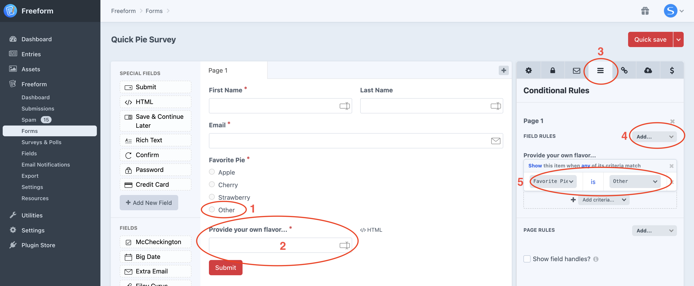
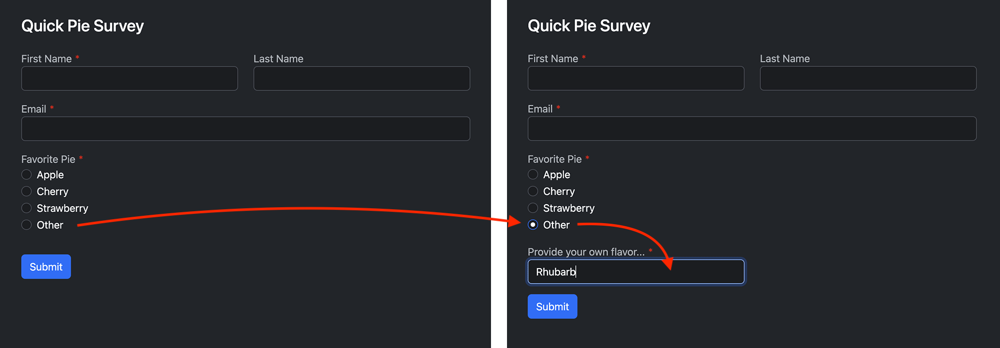

<meta property="og:image" content="https://docs.solspace.com/extras/social/craft/freeform/freeform.png" />

    
    Freeform
    for Craft
    

        

            5.x
            ✓ Latest
            
        

        <ul class="pr-v-list">
            <li><a href="/craft/freeform/v5/">5.x✓ Latest</a></li>
            <li><a href="/craft/freeform/v4/">4.x</a></li>
            <li><a href="/craft/freeform/v3/">3.xRetired</a></li>
            <li><a href="/craft/freeform/v2/">2.xRetired</a></li>
            <li><a href="/craft/freeform/v1/">1.xRetired</a></li>
        </ul>
    

    

        <a href="https://plugins.craftcms.com/freeform" class="button button-blue">Plugin Store</a>
    

<a href="/craft/freeform/v5/guides/">User Guides</a>

# Include an "Other" Option for Fields

It's possible to have an extra option inside your [Dropdown](../forms/fields.md#dropdown) or [Radios](../forms/fields.md#radios) field containing an "Other" choice, and when chosen, display an input field for them to fill in their other option.

While Freeform fields don't have this built-in, you can simulate this with the [Conditional Rules](../forms/conditional-rules.md) feature. You can set it so that when a user selects the "Other" option in a Dropdown/Radios field, an extra field (its own field, not related to that Dropdown/Radios field) appears for the user to fill it in.

[[toc]]

## Instructions

Here's how to do it:

<label for="step1"><input type="checkbox" class="step-check" id="step1">

### Step 1

</label>

- Add an option named `Other` to one of your existing _Dropdown_ or _Radios_ fields (this can also apply to other field types as well).
    - For this example, we'll make it a Radio field and call it `Favorite Pie` with a handle of `favoritePie`.

<label for="step2"><input type="checkbox" class="step-check" id="step2">

### Step 2

</label>

- Create a new field of the _Text_ type and place it in the field layout close to your _Dropdown_ or _Radios_ field (wherever you'd like it to show up).
    - For this example, we'll call it `Provide your own flavor...` with a handle of `favoritePieOther`.
    - You might notice in the screenshot below that a blank [HTML block](../forms/fields/#html) was added at the right as a workaround to have the **Other** field not take the full width of the form.

<label for="step3"><input type="checkbox" class="step-check" id="step3">

### Step 3

</label>

- In the [Conditional Rules](../forms/conditional-rules/) tab, follow these steps:
    - Add rules to Page 1 (or whatever your page name is).
    - For _Field Rules_, select _Add..._ and choose the `Provide your own flavor...` field.
    - In the _Add criteria_ dropdown, choose the `Favorite Pie` field.
    - Set the other dropdown to be your new `Other` option.

Finished!

### Screenshots

