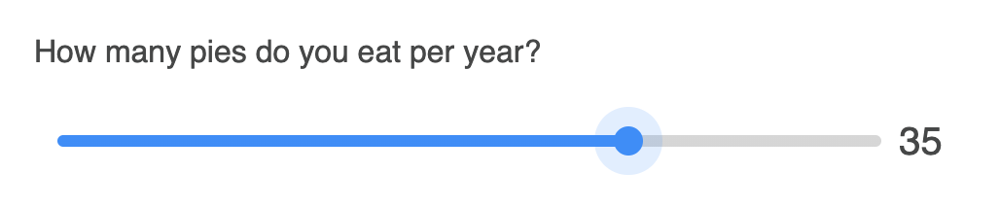
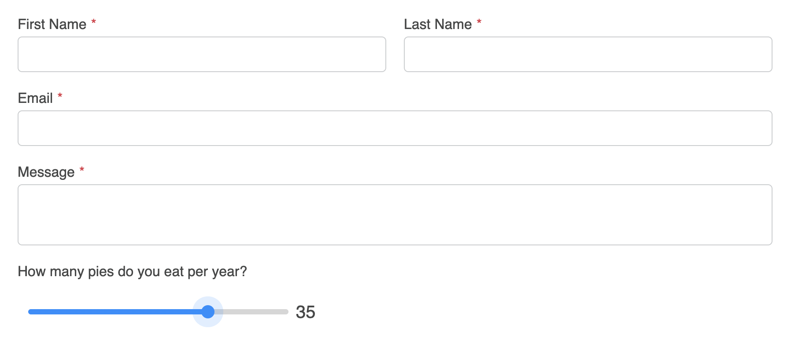

<meta property="og:image" content="https://docs.solspace.com/extras/social/craft/freeform/freeform.png" />

<div id="pr-heading">
    
    <span class="pr-name">Freeform</span>
    <span class="pr-category">for Craft</span>
    <div class="pr-v-wrapper">
        <div class="pr-v">
            <span class="pr-v-v">5.x</span>
            <span class="pr-v-type pr-latest">✓ Latest</span>
            <span class="pr-v-arrow arrow down"></span>
        </div>
        <ul class="pr-v-list">
            <li><a href="/craft/freeform/v5/">5.x<span class="pr-v-type pr-latest">✓ Latest</span></a></li>
            <li><a href="/craft/freeform/v4/">4.x</a></li>
            <li><a href="/craft/freeform/v3/">3.x<span class="pr-v-type pr-retired">Retired</span></a></li>
            <li><a href="/craft/freeform/v2/">2.x<span class="pr-v-type pr-retired">Retired</span></a></li>
            <li><a href="/craft/freeform/v1/">1.x<span class="pr-v-type pr-retired">Retired</span></a></li>
        </ul>
    </div>
    <div class="pr-buy">
        <a href="https://plugins.craftcms.com/freeform" class="button button-blue"><span class="external-url">Plugin Store</span></a>
    </div>
</div>

<span class="page-section"><a href="/craft/freeform/v5/guides/">User Guides</a></span>

# Range Slider on Number field

It's possible to easily implement `range` field type styling/handling on regular [Text](../forms/fields/#text) or [Number](../forms/fields/#number) fields.


[[toc]]


## Instructions

<div class="step">
<label for="step1"><input type="checkbox" class="step-check" id="step1">

### Step 1

</label>

To familiarize yourself with the Range field type, a basic code example looks something like this:

``` html
<label>How many pies do you eat per year?</label>
<div class="freeform-range">
    <input type="range" name="myFieldHandle" id="myFieldHandle" min="0" max="100" step="5" value="0" /> 
</div>
```

This will output the following (go ahead and play with it!):

><p>How many pies do you eat per year?</p>
><div class="freeform-range">
>    <input type="range" name="myFieldHandle" id="myFieldHandle" min="0" max="100" step="5" value="0" style="width: 50% !important;" /> 
></div>

</div>

<div class="step">
<label for="step2"><input type="checkbox" class="step-check" id="step2">

### Step 2

</label>

What you might like to do is replace [Number](../forms/fields/#number) fields with a range slider. The Number field allows you to configure the Range features from inside the form builder. Your code can then include things like `minValue`, `maxValue`, `step`, and `defaultValue`:

``` twig
{{ field.renderLabel() -}}
<div class="freeform-range">
    <input type="range" min="{{ field.minValue }}" max="{{ field.maxValue }}" step="{{ field.step }}" value="{{ field.defaultValue ? field.defaultValue : '0' }}" name="{{ field.handle }}" id="form-input-{{ field.handle }}" /> 
    <span>{{ field.defaultValue ? field.defaultValue : '0' }}</span>
</div>
```

</div>

<div class="step">
<label for="step3"><input type="checkbox" class="step-check" id="step3">

### Step 3

</label>

To add a bit of your own styling to the Range field, you can begin with the following CSS:

``` css
.freeform-range {
    display: flex;
    align-items: center;
    max-width: 500px;
    height: 4rem;
    width: 80%;
    padding: 0px 10px;
}
.freeform-range input[type=range] {
    -webkit-appearance: none;
    appearance: none; 
    width: 100%;
    height: 6px;
    cursor: pointer;
    outline: none;
    border-radius: 15px;
    padding: 0 !important;
    border: 0 !important;
    background: #d6d6d6;
}
.freeform-range input[type=range]::-webkit-slider-thumb {
    -webkit-appearance: none;
    appearance: none; 
    height: 15px;
    width: 15px;
    background-color: #058ffe;
    border-radius: 50%;
    border: none;
    transition: all .25s;
}
.freeform-range input[type=range]::-moz-range-thumb {
    height: 15px;
    width: 15px;
    background-color: #058ffe;
    border-radius: 50%;
    border: none;
    transition: all .25s;
}
.freeform-range input[type=range]::-webkit-slider-thumb:hover,
.freeform-range input[type=range]:active::-webkit-slider-thumb {
    box-shadow: 0 0 0 10px rgba(5,143,254, .15)
}
.freeform-range input[type=range]::-moz-range-thumb:hover,
.freeform-range input[type=range]:active::-moz-range-thumb {
    box-shadow: 0 0 0 10px rgba(5,143,254, .15)
}
.freeform-range span {
    font-size: 20px;    
    width: 40px;
    text-align: center;
}
```

Then include the following JS in order to handle the output of value selected in the range, and correctly style the progress bar:

``` js
const freeformRange = document.querySelector(".freeform-range input[type=range]")
const freeformRangeValue = document.querySelector(".freeform-range span")

freeformRange.addEventListener("input", (event) => {
    const freeformRangeValueProgress = event.target.value; 
    freeformRangeValue.textContent = freeformRangeValueProgress;
    
    const progress = (freeformRangeValueProgress / freeformRange.max) * 100;
    
    freeformRange.style.background = `linear-gradient(to right, #058ffe ${progress}%, #d6d6d6 ${progress}%)`;
})
```

The result should look something like this:



</div>

<div class="step">
<label for="step4"><input type="checkbox" class="step-check" id="step4">

### Step 4

</label>

In order for this to automatically happen inside a [formatting template](../forms/formatting-templates/), you'll want to create a new one if you haven't already. If you using the [Basic Light](../templates/formatting/basic-light/) formatting template as a starting point, your code might look something like this:

``` twig {4-11}
{# Shortened for Example #}
...
    <div class="freeform-fieldtype-{{ field.type }}">
        
            {{ field.renderLabel() }}
            {{ field.renderInstructions() }}
            <div class="freeform-range">
                <input type="range" min="{{ field.minValue }}" max="{{ field.maxValue }}" step="{{ field.step }}" value="{{ field.defaultValue ? field.defaultValue : '0' }}" name="{{ field.handle }}" id="form-input-{{ field.handle }}" /> 
                <span>{{ field.defaultValue ? field.defaultValue : '0' }}</span>
            </div>
            {{ field.renderErrors() }}
        
            {{ field.render() }}
...
{# Shortened for Example #}
```

::: tip
Don't forget to include the custom CSS and JS that was mentioned in [Step 3](#step3).
:::

The result might look something like this:



</div>

<div class="step-finished">Finished!</div>

::: tip
Please see [MDN Web Docs](https://developer.mozilla.org/en-US/docs/Web/HTML/Element/input/range) for more information about **Range** input elements.
:::