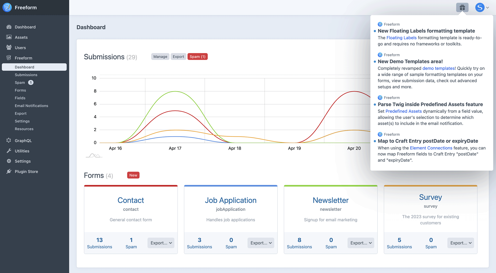

<meta property="og:image" content="https://docs.solspace.com/extras/social/craft/freeform/freeform.png" />

    
    Freeform
    for Craft
    

        

            5.x
            ✓ Latest
            
        

        <ul class="pr-v-list">
            <li><a href="/craft/freeform/v5/">5.x✓ Latest</a></li>
            <li><a href="/craft/freeform/v4/">4.x</a></li>
            <li><a href="/craft/freeform/v3/">3.xRetired</a></li>
            <li><a href="/craft/freeform/v2/">2.xRetired</a></li>
            <li><a href="/craft/freeform/v1/">1.xRetired</a></li>
        </ul>
    

    

        <a href="https://plugins.craftcms.com/freeform" class="button button-blue">Plugin Store</a>
    

<a href="/craft/freeform/v5/guides/">User Guides</a>

# How to Stay Informed

How to stay informed with updates, fixes and new features for Freeform.

[[toc]]

## Instructions

Here are the best ways to stay informed about updates to Freeform:

<label for="step1"><input type="checkbox" class="step-check" id="step1">

### Review the Changelog

</label>

Carefully review the [changelog](../configuration/changelog/), available inside the Craft CP **Updates** page or on our documentation site. This will contain the most detailed list of fixes/changes/additions to each version of Freeform.

<label for="step2"><input type="checkbox" class="step-check" id="step2">

### Enable the Update Notices feature

</label>

The [Update Notices](../configuration/notices-alerts/) feature keeps you informed about issues that may specifically affect your site. Then pair it with the [Developer Digest](../configuration/notices-alerts/) email notifications (weekly or daily). Every few hours, Freeform will check and see if there are any new updates available, pull the feed and then compare it against your current site environment and setup and only show you notices and warnings that apply specifically to that site. This will ensure you catch issues much sooner and minimize form issues.

<label for="step3"><input type="checkbox" class="step-check" id="step3">

### Craft Announcement Notices

</label>

Larger updates will generate [Craft Announcement](../configuration/notices-alerts/#update-notices-announcements) notices (gift icon) inside the Craft control panel.

<label for="step4"><input type="checkbox" class="step-check" id="step4">

### Follow us on Twitter

</label>

Follow us on [Twitter](https://twitter.com/solspace) to see occasional info about new or upcoming features, larger updates, and guides.

<label for="step5"><input type="checkbox" class="step-check" id="step5">

### Subscribe to our Email Newsletter

</label>

[Subscribe to our email newsletter](https://email.solspace.com/h/r/68FF16F7F30A55692540EF23F30FEDED) to receive occasional updates (every 1-2 months) about important updates, exciting new features, and tips and tricks for using our software.

Finished!

