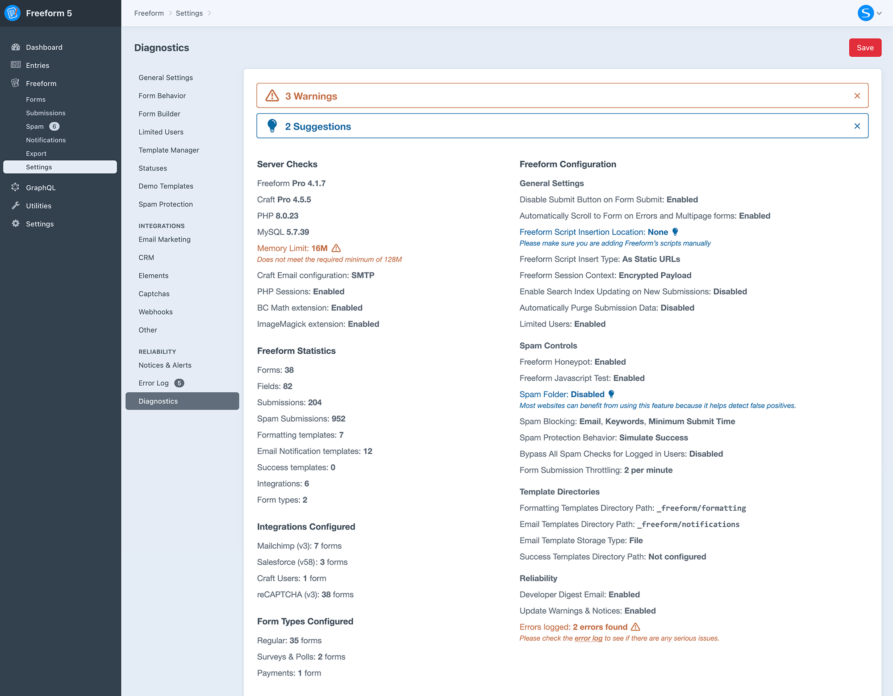
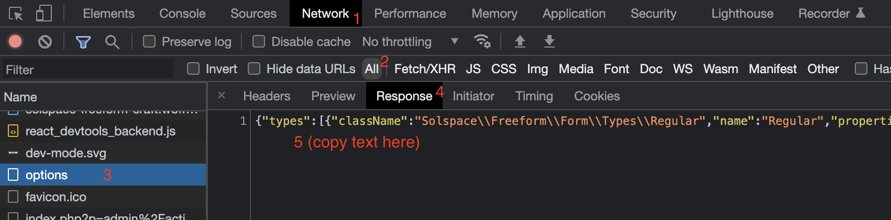
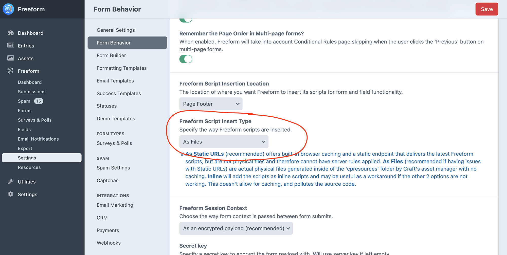

<meta property="og:image" content="https://docs.solspace.com/extras/social/craft/freeform/freeform.png" />

<div id="pr-heading">
    
    <span class="pr-name">Freeform</span>
    <span class="pr-category">for Craft</span>
    <div class="pr-v-wrapper">
        <div class="pr-v">
            <span class="pr-v-v">5.x</span>
            <span class="pr-v-type pr-latest">✓ Latest</span>
            <span class="pr-v-arrow arrow down"></span>
        </div>
        <ul class="pr-v-list">
            <li><a href="/craft/freeform/v5/">5.x<span class="pr-v-type pr-latest">✓ Latest</span></a></li>
            <li><a href="/craft/freeform/v4/">4.x</a></li>
            <li><a href="/craft/freeform/v3/">3.x<span class="pr-v-type pr-retired">Retired</span></a></li>
            <li><a href="/craft/freeform/v2/">2.x<span class="pr-v-type pr-retired">Retired</span></a></li>
            <li><a href="/craft/freeform/v1/">1.x<span class="pr-v-type pr-retired">Retired</span></a></li>
        </ul>
    </div>
    <div class="pr-buy">
        <a href="https://plugins.craftcms.com/freeform" class="button button-blue"><span class="external-url">Plugin Store</span></a>
    </div>
</div>

<span class="page-section"><a href="/craft/freeform/v5/guides/">User Guides</a></span>

# Troubleshooting Form Issues

This guide walks you through troubleshooting and diagnosing some of the most commonly reported issues with your form's appearance, behavior, or submission of the form on the front end.


[[toc]]


## Instructions

<div class="step">
<label for="step1"><input type="checkbox" class="step-check" id="step1">

### Check Freeform Diagnostics page

</label>

Some of the most common issues in Freeform are related to the following:

1. A newer version of Freeform resolves the issue. Please make sure you're using the latest version of Freeform, or at least check the [Changelog](../configuration/changelog/) to see if any relevant items have been fixed in newer versions.
2. [Javascript Test for Honeypot](../forms/spam-protection/#freeform-javascript-test) is enabled. This feature can be powerful for helping prevent spam on your forms, but it can easily break if your forms are not called correctly and/or you're using caching on your site. If using caching + Javascript Test feature, please see the [Caching](../templates/caching/) guide.
3. The [Freeform Script Insert Location](../configuration/settings/#freeform-javascript-insertion-location) setting is set to `Manual`. Most sites should use `Page Footer`, but in some cases it may be necessary to load these manually. If you must use `Manual`, please make sure you're loading Freeform's scripts in your forms with `freeform.loadFreeformPlugin()`. Please see the guide in the [JS Plugin documentation](../developer/js-plugin/#loading-freeform-js-manually) for more info.
4. There's an issue that Freeform has logged in the [Error Logs](../configuration/settings/#error-log). Freeform will sometimes log issues it discovers in its own error log file. Check out this area and see if there are any clues as to what might be causing the issue.

If no relevant issues are found on the [Diagnostics](../configuration/diagnostics/) page, please proceed to step 2 below...



</div>

<div class="step">
<label for="step2"><input type="checkbox" class="step-check" id="step2">

### Create a New Simple Template

</label>

Sometimes a quick and easy solution is to create a new template and add a basic Freeform form using the default Freeform sample template. This will help identify whether the issue is caused by errors in custom formatting templates, configuration issues, or other scripts that conflict with Freeform's.

This can alternatively be done by installing and using the [Demo Templates](../configuration/demo-templates/) that come with Freeform.

1. Create a new template in your Craft `/templates/` directory. Please ensure this is a blank template file, clean of any existing site layouts, scripts, etc.
2. Copy and paste the following code into your new template, but replace `yourFormHandle` with the actual handle of your form:
    ``` twig
    <html>
    <head></head>
    <body>

    {{ freeform.form("yourFormHandle", {
        formattingTemplate: 'basic-light/index.twig'
    }).render() }}

    </body>
    </html>
    ```
    - The `formattingTemplate: 'basic-light/index.twig'` parameter will force Freeform's **Basic Light** formatting template, which could help narrow down whether there are issues with your own custom formatting template (if applicable).
    ::: warning
    It is not enough to just paste the `freeform.form` query into a blank template. It needs to contain the closing `</body`>` tag to know where to insert Freeform's scripts (if using the **Page Footer** option).
    :::

</div>

<div class="step">
<label for="step3"><input type="checkbox" class="step-check" id="step3">

### Load Your Form and Test

</label>

Go to the newly created template to load the form and see if everything works and behaves correctly.

1. Does the form appear to display and behave correctly?
2. Does the form submit correctly, without issue?

---

**<span class="green">Works?</span>** If the form displays and behaves correctly in this isolated test, it could be an issue with your custom formatting template or conflicts from other scripts with Freeform's scripts.

- To troubleshoot this further, **work in small steps**. Stay inside the isolated test template and follow the steps below:
    1. Remove the `formattingTemplate: 'basic-light/index.twig'` parameter (thus pulling in your chosen and potentially problematic formatting template) from the [Form query](../templates/queries/form/) and see how the form displays and behaves.
    2. The isolated template may continue to display and behave incorrectly due to missing styles and assets. Try slowly pulling in some of those into the isolated test template and see if it breaks.
    3. If issues continue, compare your custom formatting template to existing [formatting template examples](../templates/formatting/) included with Freeform.
    4. If you're still not getting anywhere, try creating a brand new custom formatting template based on one of the [formatting template examples](../templates/formatting/) included with Freeform.
        - Load it in the isolated test template and confirm it works correctly.
        - Slowly modify it to become closer to your original custom formatting template, checking the isolated test template often along the way to see when/where it breaks.
        - This process will help you narrow down where the issue might be.

**<span class="red">Still Issues?</span>** If issues are still occurring in this isolated test, there could be an issue with your Freeform settings, site or server configuration, or server rewrite rules.

- Proceed to step 4 for diagnosing common issues...

</div>

<div class="step">
<label for="step4"><input type="checkbox" class="step-check" id="step4">

### Check the Browser Console and Network Response

</label>

If the form still isn't loading or submitting correctly, check the browser's _Console_ and see if any JS errors are logged. Also, check the _Network_ tab for any issues. What you'll be looking for is the _Response_ from a failed item.

1. Click on the _Network_ tab.
2. In the filters menu, select _All_ to ensure all items are shown.
3. Look for any items that are in <span class="red">red</span> and click on them. In the case of the below example, the `options` item was red.
4. On the bottom-right side, click on the _Response_ tab.
5. The error will be logged here and will likely provide a clue as to where the issue might be. If you need assistance from the Solspace team, copy the error message there and [create a new GitHub issue or private support ticket](/support/).



<br />

#### 404 Errors for `freeform/plugin.js`
If the JS in your form is not working (and/or a lot of submissions are incorrectly marked as spam) and you're seeing an error like `freeform/plugin.js net::ERR_ABORTED 404 (Not Found)` in the browser console, it's almost certainly due to your site having server rules you have applied to JS and CSS files to see if they are actual files. The default for Freeform is to load its scripts as **Static URLs**, which becomes a problem in this case. To resolve this issue, you can switch the _Freeform Script Insert Type_ setting (_Craft CP → Freeform → Settings → Form Behavior_) to **As Files** instead.

- **As Static URLs** offers built-in browser caching and a static endpoint that delivers the latest Freeform scripts but are not physical files and therefore cannot have server rules applied.
- **As Files** (recommended if having issues with _Static URLs_) are actual physical files generated inside of the `cpresources` folder by Craft's asset manager with no caching.
- **Inline** will add the scripts as inline scripts and may be useful as a workaround if the other 2 options are not working. This doesn't allow for caching and pollutes the source code.

::: tip
If you're experiencing this issue only in one environment (like production), it's perfectly safe to just set all environments to use **As Files** without issue.
:::



</div>

<div class="step">
<label for="step5"><input type="checkbox" class="step-check" id="step5">

### Contact Solspace Support

</label>

If you are unable to figure out the issue and need assistance from the Solspace team, please don't hesitate to [create a new GitHub issue or private support ticket](/support/) and provide all relevant information you discovered while attempting to troubleshoot the issue.

<a href="/support/" class="button"><span>See Support Options</span></a>

</div>

<div class="step-finished">Finished!</div>
