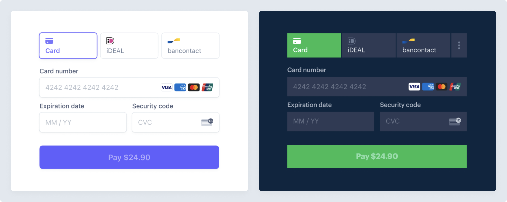
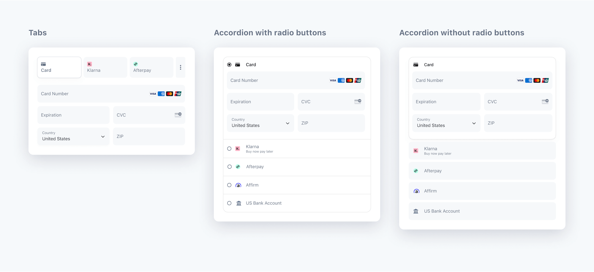
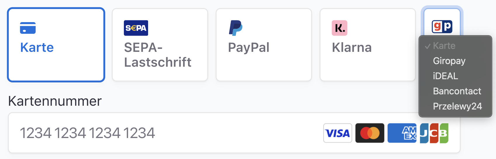
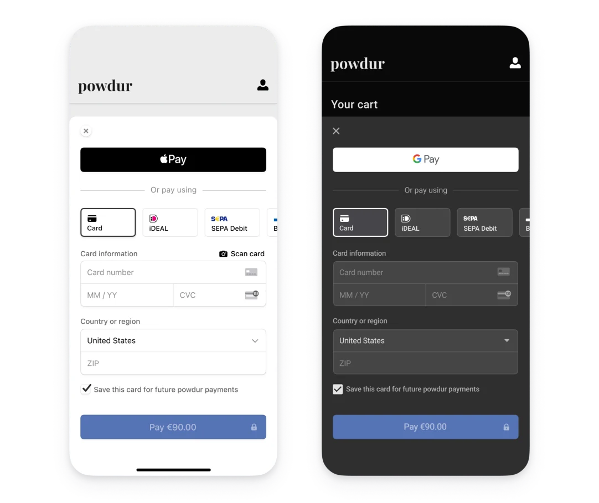
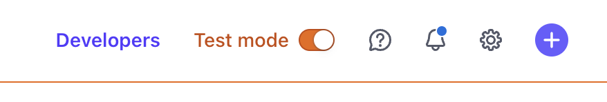

<meta property="og:image" content="https://docs.solspace.com/extras/social/craft/freeform/freeform.png" />

<div id="pr-heading">
    
    <span class="pr-name">Freeform</span>
    <span class="pr-category">for Craft</span>
    <div class="pr-v-wrapper">
        <div class="pr-v">
            <span class="pr-v-v">5.x</span>
            <span class="pr-v-type pr-latest">✓ Latest</span>
            <span class="pr-v-arrow arrow down"></span>
        </div>
        <ul class="pr-v-list">
            <li><a href="/craft/freeform/v5/">5.x<span class="pr-v-type pr-latest">✓ Latest</span></a></li>
            <li><a href="/craft/freeform/v4/">4.x</a></li>
            <li><a href="/craft/freeform/v3/">3.x<span class="pr-v-type pr-retired">Retired</span></a></li>
            <li><a href="/craft/freeform/v2/">2.x<span class="pr-v-type pr-retired">Retired</span></a></li>
            <li><a href="/craft/freeform/v1/">1.x<span class="pr-v-type pr-retired">Retired</span></a></li>
        </ul>
    </div>
    <div class="pr-buy">
        <a href="https://plugins.craftcms.com/freeform" class="button button-blue"><span class="external-url">Plugin Store</span></a>
    </div>
</div>

<span class="page-section"><a href="/craft/freeform/v5/integrations/">Integrations</a></span>

# Stripe Payments <Badge type="pro" text="Pro" /><Badge type="feature" text="Improved in 5.0+" />

<video autoplay loop muted>
    <source src="../../videos/stripe-payments.mp4" type="video/mp4">
    This browser does not display the video tag.
</video>

[[toc]]

<div class="menu-grid">
    <a href="#key-features" class="menu-box">
        
        <div class="menu-grid-text">
            <h3>Key Features</h3>
            <p>A list of the key features.</p>
        </div>
    </a>
    <a href="#requirements" class="menu-box">
        
        <div class="menu-grid-text">
            <h3>Requirements</h3>
            <p>Requirements to use Stripe on your site.</p>
        </div>
    </a>
    <a href="#best-practices" class="menu-box">
        
        <div class="menu-grid-text">
            <h3>Best Practices</h3>
            <p>Best ways to implement Stripe.</p>
        </div>
    </a>
    <a href="#customization" class="menu-box">
        
        <div class="menu-grid-text">
            <h3>Customization</h3>
            <p>How to customize the appearance.</p>
        </div>
    </a>
    <a href="#setting-up" class="menu-box">
        
        <div class="menu-grid-text">
            <h3>Setting Up</h3>
            <p>How to get started with Stripe.</p>
        </div>
    </a>
    <a href="#templating" class="menu-box">
        
        <div class="menu-grid-text">
            <h3>Templating</h3>
            <p>Special properties available in templates.</p>
        </div>
    </a>
    <a href="#email-notifications" class="menu-box">
        
        <div class="menu-grid-text">
            <h3>Email Notifications</h3>
            <p>Using email notifications with Stripe.</p>
        </div>
    </a>
    <a href="#testing" class="menu-box">
        
        <div class="menu-grid-text">
            <h3>Testing</h3>
            <p>How to test Stripe in your forms.</p>
        </div>
    </a>
</div>


## Key Features

Freeform Payments uses the [Payment Element](https://stripe.com/docs/payments/payment-element) approach from [Stripe](https://stripe.com). The Payment Element is a UI component that accepts 40+ payment methods, validates input, and handles errors. This means that in addition to accepting **credit cards**, it will allow you to enable support for **Stripe Link**, **Apple Pay**, **Google Pay**, **PayPal** (within Europe), **bank payments**, **deferred payments** and many other options. Within minutes you can have anything from a form accepting donations to a [membership registration form](../../guides/user-registration-forms/) that has users pay for a subscription at any interval. The possibilities are endless!

<div class="feature-grid">
    <div>
        
         <div class="feature-grid-text">
            <h3>40+ Payment Methods <Badge type="feature" text="New!" /></h3>
            <p>Accept <b>credit cards</b>, <b>Stripe Link</b>, <b>Apple Pay</b>, <b>Google Pay</b>, <b>PayPal</b> (within Europe), <b>bank payments</b>, <b>deferred payments</b> and more! <a href="#configuring-payment-methods">Learn&nbsp;more&nbsp;→</a></p>
        </div>
    </div>
    <div>
        
         <div class="feature-grid-text">
            <h3>Secure Processing</h3>
            <p>All payment processing goes securely through Stripe. Freeform does not gain any access to any sensitive credit card or banking information.</p>
        </div>
    </div>
    <div>
        
         <div class="feature-grid-text">
            <h3>Plug & Play</h3>
            <p>No technical knowledge is required to enable Stripe for your site. Follow our simple instructions and you'll be ready in minutes!</p>
        </div>
    </div>
    <div>
        
         <div class="feature-grid-text">
            <h3>One-time Payments</h3>
            <p>Allow users to select or specify their own one-time payment. This could be for accepting donations, paying invoices, selling products and more!</p>
        </div>
    </div>
    <div>
        
         <div class="feature-grid-text">
            <h3>Subscriptions</h3>
            <p>Allow users to select or configure their own recurring payments. This could be for memberships, donations, services and more!</p>
        </div>
    </div>
    <div>
        
         <div class="feature-grid-text">
            <h3>Choice of Payment <Badge type="feature" text="New!" /></h3>
            <p>Optionally allow users choose whether their payment is one-time, recurring, or done offline (not processed in your form).</p>
        </div>
    </div>
    <div>
        
         <div class="feature-grid-text">
            <h3>Customizable</h3>
            <p>The Stripe field is highly customizable and even comes with a style guide and several built-in settings to control its appearance to match your site.</p>
        </div>
    </div>
    <div>
        
         <div class="feature-grid-text">
            <h3>Map Freeform Data to Stripe</h3>
            <p>Easily map Freeform fields to Stripe fields to populate more customer information for the transaction/customer profile in Stripe.</p>
        </div>
    </div>
    <div>
        
         <div class="feature-grid-text">
            <h3>Email Notifications</h3>
            <p>Send email notification to users about the success or failure and payment details of their payment transaction. No sensitive payment data will be included.</p>
        </div>
    </div>
</div>


## Requirements

The Freeform Stripe integration has the following requirements:

- Freeform **Pro** edition.
    - If you're using another edition, you can [switch/upgrade](../../setup/installing-updating/#changing-editions) for the difference in price.
- Your own [Stripe](https://stripe.com) account.
- All API requests must be made over **HTTPS**. Testing can be done while using HTTP in Test Mode, however.
- Publicly accessible site is required to **fully** test or use Stripe.
    - You can forego **webhooks** testing if you like, however, and use a non-public local dev site.
    - When using on a local dev site, you will need to use a domain extension like `.test` in order for Stripe to recognize it.
    - If using a local dev machine, you can work around this by using a service like **[ngrok](https://ngrok.com/product)**. You can still access your site via the local dev URL, as long as the public version is working and Stripe is aware of it.
- When using [multi-page](../../forms/builder/#multi-page-forms) forms, the Stripe Element field should be placed on the last page of the form.
- The built-in [Success Behavior](../../forms/builder/#success-errors) setting will be ignored, as a **Success** and **Fail** Redirect URL path will need to be specified.


## Best Practices <Badge type="recommended" text="Recommended" />

The following are best practices when implementing the Stripe Element field to accept payments in your form.

### Place Stripe field on Last Page

_Stripe_ makes some strong recommendations and assumptions that the _Stripe Payment Element_ will only be displayed once the payment amount is determined and payment is ready to be made (on the last page of a multi-page form). Therefore, it works best when its placed on the last page inside of a [multi-page](../../forms/builder/#multi-page-forms) form.

If you choose **not** to do it this way, some Stripe behaviors are worked around to ensure the feature still works:

- The Stripe Payment Element field will not load if there is no payment amount entered or selected (when allowing the user to specify). When possible, either default the _Amount_ field to something other than `0` or empty OR ensure that the _Amount_ field is on an earlier page than the Stripe Payment Element field so it is populated in time. If the _Amount_ field is empty or `0`, the Stripe Payment Element field will display the message: `Could not load payment element`.
- If allowing users to dynamically configure payment amount and/or interval when the Stripe Payment Element field is in the same page, the form will temporarily disable each time one of those fields is modified and the Stripe Payment Element field will reload.
- The Stripe.com dashboard will display an `Incomplete` or `Canceled` transaction each time the Stripe Payment Element field is loaded to a user and NOT completed or a payment amount or interval is changed while the Stripe field is present. To prevent this, avoid showing the Stripe Payment Element field and keep it on the last page of a multi-page form.

### Conditional Rules for Multiple Payment Options

It's possible to allow multiple payment options inside the same form. For example, you could include both a _one-time_ and _subscription_ payment option in the same form. However, simply show and hide the Stripe payment fields with [conditional rules](../../forms/conditional-rules/).


## Customization
The Stripe Payment Element allows for customization to fit your site's styles and needs.

### Appearance
The appearance of the Stripe Payment Element can be customized to match your site. Choose a theme or update specific details.



### Layout Options
You can customize the Payment Element's layout to fit your desired flow. The following image is the same Payment Element rendered using different layout configurations.



### Payment Methods
The Payment Element displays every payment method that's activated and available (handled inside the Stripe.com website dashboard). It automatically sorts these payment methods by relevance to your customer's location and locale. For instance, if a customer in Germany is paying in EUR, they see all the active payment methods that accept EUR, starting with ones that are widely used in Germany.



#### Apple Pay & Google Pay
The Stripe Payment Element includes built-in support for Apple Pay and Google Pay.




## Setting Up

### Setting up the Payment Gateway

The following instructions assume you already have a Stripe account. You can add the Stripe integration by doing the following:

<div class="step">
<label for="step1"><input type="checkbox" class="step-check" id="step1">
<h3>Prepare Freeform</h3>
</label>

- Go to the _Payments_ section under Freeform Settings (**Freeform** → **Settings** → **Payments**).
- Click on the **New Integration** button at the top right.
- For **Service Provider**, select _Stripe_. Provide your integration a name in the **Name** and **Handle** fields.

</div>

<div class="step">
<label for="step2"><input type="checkbox" class="step-check" id="step2">
<h3>Prepare Stripe</h3>
</label>

Open up another browser tab and go to your Stripe account:

- On the top menu, click on the **Developers** button. On the next page click **API Keys**.

::: tip
Stripe can be run in **Live** mode or **Test** mode. To toggle between Live and Test mode, click the **Test mode** toggle at the top of the page. When doing this, the _Publishable key_ and _Secret key_ will switch between live and test as well. We strongly recommend switching Stripe to **Test** mode first, and testing your site with those keys instead.


:::

- Copy the token for **Publishable key** (e.g. `pk_test_fs7f6f8g8dfg68g68d76dgd8`) and paste into the **Public Key** field inside Freeform.
- Copy the token (click *Reveal test key* button to reveal) for **Secret key** (e.g. `sk_test_af7fa7gfdo78g6ddfg6d8d87`) and paste into the **Secret Key** field inside Freeform.

::: tip
Consider using an **Environment Variable** for these settings instead. Then, store _Live_ keys on production and _Test_ keys on local dev environments.
:::

</div>

<div class="step">
<label for="step3"><input type="checkbox" class="step-check" id="step3">
<h3>Configure the Stripe Webhook</h3>
</label>

- Click on the **Webhooks** tab inside the Stripe **Developers** page.
- On the next page, click the **+ Add endpoint** button.
- Configure the webhook:
    - Copy the **Webhook URL** field value in Freeform (e.g. `http://my-precio.us/freeform/payment-webhooks/stripe?id=1`) and paste it into the **Endpoint URL** setting.
    - For the **Listen to** setting, choose **Events on your account**.
    - Click on the **Select events** button under the **Select events to listen to** setting. Add the following 4 events Freeform requires:
        - `customer.subscription.created`
        - `customer.subscription.deleted`
        - `invoice.payment_failed`
        - `invoice.payment_succeeded`
    - Click the **Add endpoint** button to save it.
- On the next page inside Stripe account, click on the newly created endpoint URL.
- At the top of the next page, you'll see an item called **Signing secret**.
- Click on the **Reveal** button below it, and then copy the token (e.g. `whsec_dsf87d876sdf7g876fd8fasd9f7dsasd`).

</div>

<div class="step">
<label for="step4"><input type="checkbox" class="step-check" id="step4">
<h3>Complete the Connection</h3>
</label>

- Switch back to the Payment integration inside Freeform, and paste the Stripe **Signing secret** token into the **Webhook Secret** setting.
- Save the integration, and it should be ready.

</div>

<div class="step-finished">Finished!</div>


### Setting up the Form

Setting up your form to collect payments will generally consist of the following:

<div class="step">
<label for="step1b"><input type="checkbox" class="step-check" id="step1b">
<h3>Enable Integration</h3>
</label>

- Create a new form or open an existing one that will handle payments.
- Inside the **Integrations** tab, select the **Stripe** payment gateway.
- Toggle the _Enable_ setting ON.
- Map your Freeform fields to Stripe's fields as necessary.

---

#### Additional settings
- **Suppress Email Notifications & Integrations when Payments Fail**
    - Failed payments will still be stored as submissions, but enabling this will suppress email notifications and API integrations from being sent.
- **Send Success Email from Stripe to Submitter**
    - When enabled, Freeform will pass off the submitter's email address to Stripe's `receipt_email` field, automatically triggering Stripe to send a successful email notification.

</div>

<div class="step">
<label for="step2b"><input type="checkbox" class="step-check" id="step2b">
<h3>Configure Stripe Payment Field</h3>
</label>

- Inside the **Layout** tab, find **Stripe Payment** in the list of field types in the left column and drag it into the form layout.
- Click on the **Stripe Payment** field inside your field layout and configure it as necessary in the property editor left column.
    - Label & Handle
    - Required
        ::: tip
        The Stripe field does NOT have to be required. However, if you wish to go this route, it is better to have a field that allows the user to select paying in the form or "Paying offline", etc and then use Conditional Rules to show and hide the Stripe field.
        :::
    - Select the integration for the field.
    - _Description_ - enter a description for the payment. You can use the `form` and `submission` object in Twig.
    - _Payment Type_ - choose between **Single** (one-time) or **Subscription** (recurring).
        - If **Single**:
            - _Payment Amount_ - choose between **Fixed** or **Dynamic**.
                - If Dynamic, choose the field that will contain the amount.
                - Option values should contain an integer only, e.g. `49` or `89.95`.
            - _Payment Currency_ - choose a currency for payments.
        - If **Subscription**:
            - _Subscription Interval_ - choose between **Static** or **Dynamic**.
                - If Dynamic, choose the field that will contain the interval options.
                    - Options values should only be `year`, `month`, `week`, `day`.
            - _Subscription Interval Count_ - choose between **Static** or **Dynamic**.
                - If Dynamic, choose the field that will contain the interval count options, e.g. `1`, `2`, etc.
            - _Payment Amount_ - choose between **Fixed** or **Dynamic**.
                - If Dynamic, choose the field that will contain the amount.
                - Option values should contain an integer only, e.g. `49` or `89.95`.
            - _Payment Currency_ - choose a currency for payments.
    - _Successful Payment Redirect_ - specify a URL to be redirected to upon successful payment.
    - _Failed Payment Redirect_ - specify a URL to be redirected to upon failed payment.
        ::: tip
        The built-in [Success Behavior](../../forms/builder/#success-errors) setting will be ignored, as a **Success** and **Fail** Redirect URL path will need to be specified in these settings.
        :::
    - _Theme_ - choose from `Default`, `Dark`, or `Minimal`.
        - This can be used as a starting point. Check out the style guide to make further adjustments to the styles.
    - _Layout_ - choose between `Tabs`, `Accordian with radio buttons`, and `Accordian without radio buttons`.
    - _Floating Labels_ - toggle whether or not the labels should be inside the field inputs.

</div>

<div class="step">
<label for="step3b"><input type="checkbox" class="step-check" id="step3b">
<h3>Configure Email Notification</h3>
</label>

To send a success or fail email notification to the site Admin or the customer from Freeform, configure an email notification inside the **Notifications** tab in the form builder.

Example template code might look something like this:

``` twig{9-21}
<p>The following submission came in on {{ dateCreated|date('l, F j, Y \\a\\t g:ia') }}.</p>
<h2>Customer Information</h2>
<ul>
    
        <li>{{ field.label }}: {{ field.labelAsString }}</li>
    
</ul>
<hr />

    <h2>Payment Information</h2>
    <ul>
        <li>Amount: ${{ payments.amount }} {{ payments.currency }}</li>
        <li>
            Card ending in: •••• {{ payments.card }}
            ({{ payments.status }} - {{ payments.errorMessage }})
        </li>
    
        <li>{{ payments.planName }} ({{ payments.interval }})</li>
    
    </ul>

```

</div>

<div class="step-finished">Finished!</div>


### Configuring Payment Methods
The Stripe Payment Element allows you to accept 40+ payment methods, including credit cards, [Stripe Link](https://stripe.com/docs/payments/link), [Apple Pay](https://stripe.com/docs/apple-pay), [Google Pay](https://stripe.com/docs/google-pay), [PayPal](https://stripe.com/docs/payments/paypal) (within Europe), [bank payments](https://stripe.com/docs/payments/bank-redirects), [deferred payments](https://stripe.com/docs/payments/buy-now-pay-later) and more!

To enable additional payment methods for your site, visit the Stripe [Payment Methods](https://dashboard.stripe.com/settings/payment_methods) settings area (**Stripe** → **Settings Cog icon** (top right nav) → **Settings** → **Payment Methods** (under Payments section)).

Some payment methods such as _Apple Pay_ require domains to be registered. You can configure this by visiting the Stripe [Payment Method Domains](https://dashboard.stripe.com/settings/payment_method_domains) settings area (**Stripe** → **Settings Cog icon** (top right nav) → **Settings** → **Payment Method Domains** (under Payments section)).

<br />

- [Registering domains for payment methods](https://stripe.com/docs/payments/payment-methods/pmd-registration)
- [Full list of available Payment methods](https://stripe.com/docs/payments/payment-methods/overview)


### Mapping Payment Data to Other Integrations

Stripe payment data is available to map to other [integrations](../../integrations/) such as **CRMs** as well. The following options will become available to map:

* Amount
* Interval
* Interval Count
* Card Token
* Card Last 4
* Card Type
* Stripe Charge ID
* Stripe Customer ID
* Stripe Transaction Hash


## Templating

The following properties are available for use inside email notification templates and front end templates ([Submission object](../../templates/objects/submission/)):

::: v-pre
* `payments.amount`
    - Outputs the amount paid/subscribed to for the submission, e.g. `49.95`.
* `payments.interval` (subscription only)
    - Outputs the payment interval subscribed to for the submission, e.g. `biweekly`.
* `payments.currency`
    - Outputs the currency used for the submission, e.g. `usd`.
* `payments.type`
    - Outputs the payment type for the submission, e.g. `single` or `subscription`.
* `payments.status`
    - Outputs the payment status to for the submission, e.g. `paid`, `active`, `failed`.
* `payments.errorMessage`
    - Outputs the payment error message for the submission, e.g. `Your card was declined.`.
    `{{ payments.errorMessage }}`
* `payments.card`
    - Outputs the last 4 digits of the users credit card used for payment in the submission, e.g. `4242`.
* `payments.planName` (subscription only)
    - Outputs the subscription plan name subscribed to for the submission, e.g. `Enterprise Plan`.
* `payments.id`
    - Outputs the Freeform payment ID for the submission, e.g. `142`.
* `payments.resourceId`
    - Outputs the Gateway payment ID for the submission, e.g. `ch_1Cx4JHKLrxLeQvTQ5y4ei1K8`.
* `payments.gateway`
    - Outputs the name of the integration for the payment gateway used for the submission, e.g. `My Stripe Integration`.
* `payments.unsubscribeUrl` (subscription only)
    - Outputs an unsubscribe URL for the user to self-unsubscribe from a subscription, e.g. `http://my-precio.us/freeform/payment-subscription/37/cancel/2ba40891782393e3ff1ae9c3b2b6786d5318eabc`.
:::

### Submission Data Example

For displaying the **submission data**, your code may look something like this:

``` twig



    <h2>Payment Information</h2>
    <ul>
        <li>Amount: ${{ payments.amount }} {{ payments.currency }}</li>
        <li>
            Card ending in: •••• {{ payments.card }}
            ({{ payments.status }} - {{ payments.errorMessage }})
        </li>
    
        <li>{{ payments.planName }} ({{ payments.interval }})</li>
    
    </ul>

```

### Rendering Stripe Payment Element in your Form <Badge type="feature" text="Improved in 5.0+" />

For rendering the _Stripe Payment Element_ field inside your form, it simply works like any other field:

``` twig
{{ field.render() }}
```

If you wish to make any customization to the handling of Stripe payment fields, you can use the [Template Overrides](../../templates/formatting/#template-overrides) feature and do this at form level:

``` twig
{{ form.renderTag({
    fields: {
        "@stripe": {
            attributes: {
                input: {
                    "-class": "form-control bg-dark-subtle",
                },
            },
        },
    },
}) }}
```

Or at the field level by using a conditional like this:

``` twig {2}
...
`
    {{ field.render({
        attributes: {
            input: {
                class: "my-stripe-class",
            },
        },
    }) }}

...
```

### Styling the Stripe Element <Badge type="feature" text="Improved in 5.0+" />
To style the Stripe Payment Element, you'll need to use the [Freeform JS Plugin](../../developer/js-plugin/) and apply [Stripe's Appearance API variables](https://docs.stripe.com/elements/appearance-api?platform=web#variables) to the `elementOptions` and `paymentOptions` listeners.

#### elementOptions.appearance
Below is a list of commonly used variables. See [Stripe documentation](https://docs.stripe.com/elements/appearance-api?platform=web#additional-variables) for a complete list of other variables.

| Variable | Description |
| --- | --- |
| `fontFamily`| The font family used throughout Elements. Elements supports custom fonts by passing the fonts option to the Elements group. |
| `fontSizeBase`| The font size that's set on the root of the Element. By default, other font size variables like fontSizeXs or fontSizeSm are scaled from this value using rem units. |
| `spacingUnit`| The base spacing unit that all other spacing is derived from. Increase or decrease this value to make your layout more or less spacious. |
| `borderRadius`| The border radius used for tabs, inputs, and other components in the Element. |
| `colorPrimary`| A primary color used throughout the Element. Set this to your primary brand color. |
| `colorBackground`| The color used for the background of inputs, tabs, and other components in the Element. |
| `colorText`| The default text color used in the Element. |
| `colorDanger`| A color used to indicate errors or destructive actions in the Element. |

The `rules` option is a map of CSS-like selectors to CSS properties, allowing granular customization of individual components. After defining your `theme` and `variables`, use `rules` to seamlessly integrate **Elements** to match the design of your site.

The selector for a rule can target any of the public class names in the Element, as well as the supported states, pseudo-classes, and pseudo-elements for each class. For example, the following are valid selectors:

- `.Tab`, `.Label`, `.Input`
- `.Tab:focus`
- `.Input--invalid`, `.Label--invalid`
- `.Input::placeholder`

The following are not valid selectors:

- `.p-SomePrivateClass`, `img` - only public class names can be targeted
- `.Tab .TabLabel` - ancestor-descendant relationships in selectors are unsupported
- `.Tab--invalid` - the `.Tab` class does not support the `--invalid` state

See [Stripe documentation](https://docs.stripe.com/elements/appearance-api?platform=web#rules) for a complete list.

#### paymentOptions.layout
Options for creating the Payment Element.

| Property | Description |
| --- | --- |
| `defaultCollapsed: true` | Controls if the Payment Element renders in a collapsed state (where no payment method is selected by default). When you leave this undefined, Stripe renders the experience that it determines will have the best conversion. |
| `radios: true` | Renders each Payment Method with a radio input next to its logo. The radios visually indicate the current selection of the Payment Element. This property is only applicable to the accordion layout. |
| `spacedAccordionItems: false` | When true, the Payment Methods render as standalone buttons with space in between them. This property is only applicable to the accordion layout. |
| `visibleAccordionItemsCount: 2` | Sets the max number of Payment Methods visible before using the "More" button to hide additional Payment Methods. Set this value to 0 to disable the "More" button and render all available Payment Methods. Default is `5`. This property is only applicable to the accordion layout. |

Full documentation can be found here: [Stripe Elements Appearance API](https://stripe.com/docs/elements/appearance-api)

#### Example

``` html
<script>
var form = document.querySelector('[data-id="{{ form.anchor }}"]');
if (form) {
    form.addEventListener("freeform-stripe-appearance", function (event) {
        event.elementOptions.appearance = Object.assign(
            event.elementOptions.appearance,
            {
                variables: {
                    colorPrimary: "#0d6efd",
                    fontFamily: "-apple-system,BlinkMacSystemFont,\"Segoe UI\",Roboto,\"Helvetica Neue\",Arial,sans-serif,\"Apple Color Emoji\",\"Segoe UI Emoji\",\"Segoe UI Symbol\",\"Noto Color Emoji\"",
                    fontSizeBase: "16px",
                    spacingUnit: "0.2em",
                    tabSpacing: "10px",
                    gridColumnSpacing: "20px",
                    gridRowSpacing: "20px",
                    colorText: "#eaeaea",
                    colorBackground: "#1d1f23",
                    colorDanger: "#dc3545",
                    borderRadius: "5px",
                },
                rules: {
                    '.Tab, .Input': {
                        border: '1px solid #6c757d',
                        boxShadow: 'none',
                    },
                    '.Tab:focus, .Input:focus': {
                        border: '1px solid #0b5ed7',
                        boxShadow: 'none',
                        outline: '0',
                        transition: 'border-color .15s ease-in-out',
                    },
                    '.Label': {
                        fontSize: '16px',
                        fontWeight: '400',
                    },
                },
            }
        );
        event.paymentOptions.layout = Object.assign(
            event.paymentOptions.layout,
            {
                defaultCollapsed: true,
                visibleAccordionItemsCount: 3,
            }
        );
    });
}
</script>
```


## Email Notifications

### Example Usage

``` twig{9-21}
<p>The following submission came in on {{ dateCreated|date('l, F j, Y \\a\\t g:ia') }}.</p>
<h2>Customer Information</h2>
<ul>
    
        <li>{{ field.label }}: {{ field.labelAsString }}</li>
    
</ul>
<hr />

    <h2>Payment Information</h2>
    <ul>
        <li>Amount: ${{ payments.amount }} {{ payments.currency }}</li>
        <li>
            Card ending in: •••• {{ payments.card }}
            ({{ payments.status }} - {{ payments.errorMessage }})
        </li>
    
        <li>{{ payments.planName }} ({{ payments.interval }})</li>
    
    </ul>

```


## Testing

It's best practice to test out your form and Payments implementation to ensure it works correctly and as expected. Please visit the [Stripe Testing documentation](https://stripe.com/docs/testing) for a full reference of how to test your forms and get a feel for how it handles failures, etc. Also be sure to toggle the *Test mode* button in the Stripe account area for testing, as Stripe will provide you with a **different** set of keys for testing mode.

For *quick reference*, here is some general testing data:

### Testing successful purchases

- Card: `4242424242424242`
- Expiry Date: (anything in future, e.g. `2`/`42`)
- CVC: (any 3 digits, e.g. `242`)

### Testing for errors and responses

- Card: `4000000000000002` - Charge is declined with a card_declined code.
- Card: `4100000000000019` - Results in a charge with a risk level of highest. The charge is blocked as it's considered fraudulent.
- Card: `4000002760003184` - Test for [Strong Customer Authentication (SCA)](#strong-customer-authentication-sca).
    - A full list of card numbers for more scenarios can be found in the [Stripe documentation](https://stripe.com/docs/testing#regulatory-cards).

### Troubleshooting

When viewing Payment individual submissions in the control panel, the right side of the page will display a more detailed error for failed payments. If you think there might be an issue with Freeform or your implementation, this may help you look for patterns and troubleshoot.