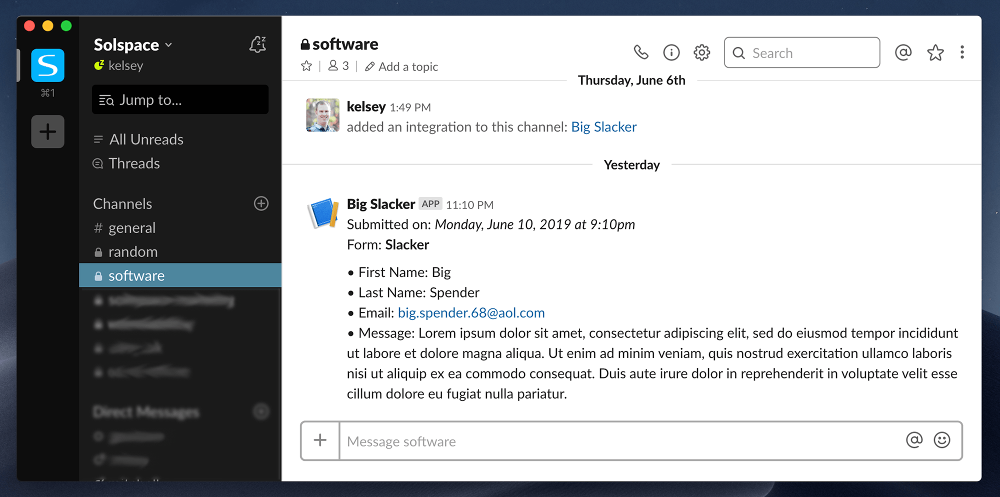

<meta property="og:image" content="https://docs.solspace.com/extras/social/craft/freeform/freeform.png" />

<div id="pr-heading">
    
    <span class="pr-name">Freeform</span>
    <span class="pr-category">for Craft</span>
    <div class="pr-v-wrapper">
        <div class="pr-v">
            <span class="pr-v-v">5.x</span>
            <span class="pr-v-type pr-latest">✓ Latest</span>
            <span class="pr-v-arrow arrow down"></span>
        </div>
        <ul class="pr-v-list">
            <li><a href="/craft/freeform/v5/">5.x<span class="pr-v-type pr-latest">✓ Latest</span></a></li>
            <li><a href="/craft/freeform/v4/">4.x</a></li>
            <li><a href="/craft/freeform/v3/">3.x<span class="pr-v-type pr-retired">Retired</span></a></li>
            <li><a href="/craft/freeform/v2/">2.x<span class="pr-v-type pr-retired">Retired</span></a></li>
            <li><a href="/craft/freeform/v1/">1.x<span class="pr-v-type pr-retired">Retired</span></a></li>
        </ul>
    </div>
    <div class="pr-buy">
        <a href="https://plugins.craftcms.com/freeform" class="button button-blue"><span class="external-url">Plugin Store</span></a>
    </div>
</div>

<span class="page-section"><a href="/craft/freeform/v5/integrations/">Integrations</a></span>

# Zapier <Badge type="pro" text="Pro" />
The Zapier integration allows you to map Freeform submission data off to virtually every popular service available such as Slack, Trello, Google Docs, Salesforce, Mailchimp, and more! You can setup as many as you like.

We will assume you already have a [Zapier](https://zapier.com/) account and some general knowledge about how to use it. While it seems just about anything is available with the free version of Zapier, having many *Zaps* and/or complex *workflows* will require [purchasing a paid plan](https://zapier.com/pricing).




## Setup Instructions

<div class="step">
<label for="step1"><input type="checkbox" class="step-check" id="step1">

### Prepare Integration on your site

</label>

- Go to the [Webhooks section in Freeform Settings](../configuration/settings/#webhooks) (**Freeform → Settings → Webhooks**)
- Click the **New Webhook** button at the top right.
- For *Service Provider*, select **Zapier**.
- Enter a name for the **Name** field.
- Pause here and open a new browser tab...

</div>

<div class="step">
<label for="step2"><input type="checkbox" class="step-check" id="step2">

### Create a new <i>Zap</i>

</label>

- Go to the [Zapier website](https://zapier.com/app/zaps) and create a new *Zap* (by clicking the bright orange *Make a Zap!* button at the top of the page).
- For the *Choose App* option, select **Webhooks by Zapier**.
- For the *Choose Trigger Event* option, select **Catch Hook**.
- Proceed to the next step, and then you'll be presented the webhook URL (e.g. `https://hooks.zapier.com/hooks/catch/12345/67890/`)
- Pause here and copy the *Custom Webhook URL* and switch back to your Freeform tab.

</div>

<div class="step">
<label for="step3"><input type="checkbox" class="step-check" id="step3">

### Finish Integration on your site

</label>

- Paste the *Custom Webhook URL* you copied earlier into the **Webhook URL** field in Freeform.
- Click the **Save** button.

</div>

<div class="step">
<label for="step4"><input type="checkbox" class="step-check" id="step4">

### Configure the Form

</label>

To use this integration on your form(s), you'll need to configure each form individually.

- Visit the form inside the form builder.
- Click on the **Integrations** tab.
- Click on **Zapier** in the list of available integrations.
- On the right side of the page:
    - Enable the integration.

</div>

<div class="step">
<label for="step5"><input type="checkbox" class="step-check" id="step5">

### Send test data to Zapier

</label>

In order for Zapier to know that Freeform exists and what data is available to it, you need to submit a test submission for the form(s) that will be using the webhook/Zap. Go to your form in the front end and submit the form with as much sample data as possible. Zapier will then be listening for the data... 

</div>

<div class="step">
<label for="step6"><input type="checkbox" class="step-check" id="step6">

### Finish creating the new <i>Zap</i>

</label>

- Switch back to the Zapier browser tab.
- Click the **Refresh Fields** button.
- Click on the next step, and choose an example submit Zapier sniffed from your test submission.
- Proceed to the next step and setup your output "Do this..." section as necessary (can be anything, so we can't fully provide steps for this part).
- Once all done, save the Zap and be sure to switch the **OFF** toggle to **ON** before trying to use the *Zap*.

</div>

<div class="step">
<label for="step7"><input type="checkbox" class="step-check" id="step7">

### Verify the Webhook

</label>

- Try submitting one of your forms that use this webhook, and check if Freeform posts successfully to it and Zapier maps correctly.
- If there are any issues on Freeform's end, you'll see errors in the Freeform error log. If there's an issue on Zapier's end, you'll see errors inside Zapier.

</div>

<div class="step-finished">Finished!</div>


## Example Output
The payload posted to Zapier will look something like this:

``` json
{
  "form__id": 1,
  "form__name": "Freeform form",
  "form__handle": "freeformForm",
  "form__color": "#8ba2a8",
  "form__description": "This is a Freeform Form",
  "form__returnUrl": "",
  "id": 1001,
  "dateCreated__date": "2018-12-31 14:00:00.000000",
  "dateCreated__timezone_type": 3,
  "dateCreated__timezone": "America\/Los_Angeles",
  "uid": "18ca11b9-bd4f-4530-9e51-f7a67ac84ec2",
  "token": "v3bJsQf5o1cYaLhzJTnn8NAiWI9gn1J4JmTpPS4Es1OZetyQS5wDO2DrAdNieiEc9KFnaBh6CcTRD9xjBf48NQfr8XxxUr1HDvj6",
  "firstName": "John",
  "lastName": "Doe",
  "message": "A custom message"
}
```