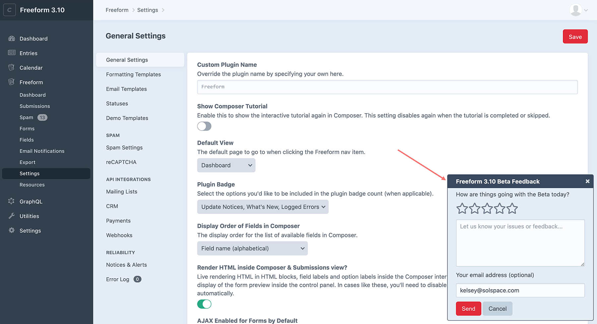

<meta property="og:image" content="https://docs.solspace.com/extras/social/craft/freeform/freeform.png" />

<div id="pr-heading">
    
    <span class="pr-name">Freeform</span>
    <span class="pr-category">for Craft</span>
    <div class="pr-v-wrapper">
        <div class="pr-v">
            <span class="pr-v-v">5.x</span>
            <span class="pr-v-type pr-latest">✓ Latest</span>
            <span class="pr-v-arrow arrow down"></span>
        </div>
        <ul class="pr-v-list">
            <li><a href="/craft/freeform/v5/">5.x<span class="pr-v-type pr-latest">✓ Latest</span></a></li>
            <li><a href="/craft/freeform/v4/">4.x</a></li>
            <li><a href="/craft/freeform/v3/">3.x<span class="pr-v-type pr-retired">Retired</span></a></li>
            <li><a href="/craft/freeform/v2/">2.x<span class="pr-v-type pr-retired">Retired</span></a></li>
            <li><a href="/craft/freeform/v1/">1.x<span class="pr-v-type pr-retired">Retired</span></a></li>
        </ul>
    </div>
    <div class="pr-buy">
        <a href="https://plugins.craftcms.com/freeform" class="button button-blue"><span class="external-url">Plugin Store</span></a>
    </div>
</div>

<span class="page-section"><a href="/craft/freeform/v5/setup/">Installing & Updating</a></span>

# Beta Testing

As part of our commitment to developing and releasing reliable and stable software, we thoroughly beta test all major and minor feature releases.


[[toc]]

::: tip
Freeform 5 is now available!
:::


## Current Beta

<!--
<h3 class="green">The Freeform 5.0 beta is now underway.</h3>
-->

<h3 class="yellow">Stay tuned for the Freeform 5.2 beta!</h3>

If you wish to join this beta, please check out the instructions and guide below.

::: danger
While we carefully develop new features and put all of it through rigorous alpha and beta testing, we cannot guarantee that there will be no major issues in beta software. It's also possible that specific edge case scenarios may have been missed, etc. For this reason, we strongly advise you <u>**not**</u> to use the current beta version in production environments.
:::

<!--
::: danger

**Before you proceed, please ensure the following:**

1. Make a copy of your site for local development testing.
2. **Backup the database and database.**
3. If this is an upgrade, carefully examine all aspects of your site and features after upgrading to ensure they're working correctly.
:::

## Overview of Changes

Please review the changelog and special notes for upgrading from Freeform 4:

<div>
    <a href="../changelog/" class="button button-lg"><span>View the Changelog</span></a>
    <a href="../updating-freeform-4/" class="button button-lg"><span>View Update Notes</span></a>
</div>

-->

<!--
Coming soon! Check back again...

Here's an overview of the **key changes** in Freeform 3.12:

- Added new [_Drag & Drop File Upload_](../forms/fields.md#file-upload-drag-drop) field type.
- Various minor additions and improvements.


## Requirements
Freeform 5.0 requires Craft 4. It has the same [server requirements as Craft 4](./installing-updating/#requirements).


## Installation
Betas cannot be installed from the Craft control panel. They must be installed manually through Composer:

::: danger
We strongly advise you <u>**not**</u> to use the current 5.0 beta version in production environments yet.
:::

<div class="step">
<label for="step1a"><input type="checkbox" class="step-check" id="step1a">

Open your CLI app and go to your Craft project:

</label>

``` sh command-line
cd /path/to/project
```

</div>

<div class="step">
<label for="step2a"><input type="checkbox" class="step-check" id="step2a">

The beta can be installed one of two ways:

</label>

``` sh command-line
composer require solspace/craft-freeform:^5.0.0-beta.13 -w
```

OR

``` sh command-line
composer require solspace/craft-freeform -w && php craft plugin/install freeform
```

</div>

<div class="step">
<label for="step3a"><input type="checkbox" class="step-check" id="step3a">

In the Craft control panel, go to *Settings → Plugins* and click the **Install** button for Freeform.

</label>

If you'd like to try out Freeform Pro, click on the *Lite / Trial* button beside the Freeform plugin name and inside the Plugin Store product page for Freeform, you can click on **Try** button for the *Pro* edition.

</div>

<div class="step-finished">Finished!</div>
<div class="counter-reset"></div>


## Updating
Betas cannot be updated from the Craft control panel. They must be updated manually through Composer:

::: warning
Please see the special [upgrade guide](./updating-freeform-4/) before proceeding.
:::

<div class="step">
<label for="step1b"><input type="checkbox" class="step-check" id="step1b">

Edit your project's `composer.json` file and update the Freeform version to 5.x:

</label>

``` diff
  "require": {
      "craftcms/cms": "^4.0.0",
      "vlucas/phpdotenv": "^5.4.0",
-     "solspace/craft-freeform": "^4.0.0",
+     "solspace/craft-freeform": "^5.0.0-beta.13",
      "solspace/craft-calendar": "^4.0.0"
  },
```

::: tip
By specifying `^` before the version number (`^5.0.0-beta.13`), for future updates you can just run `composer update` and it'll grab the latest available beta version.
:::

</div>

<div class="step">
<label for="step2b"><input type="checkbox" class="step-check" id="step2b">

Open your CLI app and go to your Craft project:

</label>

``` sh command-line
cd /path/to/project
```

</div>

<div class="step">
<label for="step3b"><input type="checkbox" class="step-check" id="step3b">

Update _composer_ to receive the latest 5.x package of Freeform by running the following command:

</label>

``` sh command-line
composer update
```

</div>

<div class="step">
<label for="step4b"><input type="checkbox" class="step-check" id="step4b">

Perform the migration one of two ways:

</label>

- In your CLI, run the following command: <Badge type="recommended" text="Recommended" />
    ``` sh command-line
    php craft migrate --plugin=freeform
    ```
    The CLI will then present something like this:

    ``` nix app-window
    [username@Computer site.test % php craft migrate --plugin=freeform 
    Checking for pending Freeform migrations ...
    Total 22 new migrations to be applied:
        m230101_100000_ConvertTextToJsonColumns
        m230101_100010_FF4to5_MigrateForms
        m230101_100020_FF4to5_MigrateLayout
        m230101_100030_FF4to5_MigrateNotifications
        m230101_100050_FF4to5_MigrateIntegrations
        m230101_100060_FF4to5_MigrateConditionalRules
        m230101_200000_FF4to5_MigrateData
        m230101_300100_FF4RemoveOldTables
        m230224_141036_RemoveRedundantFieldsFromIntegrationsTable
        m230227_102619_MoveCRMIntegrationClasses
        m230301_124411_MoveMailingListIntegrationClasses
        m230712_120518_RemoveIntegrationsQueueMailingListFieldIndex
        m230725_124256_AddCategoryToCrmFields
        m230809_081815_AddCategoryToMailingListFields
        m230824_111101_ChangeMailingListsToEmailMarketing
        m230824_163145_RemoveWebhooksTable
        m230920_103014_RemoveLastUpdateFromIntegrations
        m230925_162351_AddEnabledToIntegrations
        m231020_115409_MigrateIntegrationNamespaces
        m231116_104621_AlterPaymentTables
        m231128_142144_AddLinkToPaymentsTable
        m231206_132139_RemoveLockTable

    Apply the above migrations? (yes|no) [no]:
    ```

    **OR**
- Proceed to the Craft control panel and click the **Finish Updates** button when it shows.
    ::: warning
    Sites with a larger number of forms, fields, and submission data could experience issues doing it this way, which is why we strongly recommend the CLI approach instead.
    :::

</div>

<div class="step-finished">Finished!</div>
<div class="counter-reset"></div>

-->

## Providing Feedback
We would greatly appreciate it if you are able to provide us with routine feedback throughout your testing and usage of the beta. Even if you aren't using any of the new features or changes, providing feedback allows us to get a better idea of how things are going for all kinds of websites.

To make this even easier, we've included a Beta Feedback widget that displays in the Freeform control panel. Just click a star rating (_5/5_ to indicate if everything is going well, or less if you are experiencing any issues) and if you have anything to clarify, fill in a quick note in the textarea and click submit. You can optionally include your email address, which will also help us get in touch with you to get more information about any issues and/or assist you as necessary.

Feel free to also just use a [Private Support Ticket](/support/) or report an issue via [GitHub Issues](https://github.com/solspace/craft-freeform/issues).

::: tip
**This widget will only display during betas.** If you wish to disable it from displaying, add `FREEFORM_DISABLE_BETA_FEEDBACK_WIDGET=1` to your .ENV file.
:::





## Reporting Issues

If you're experiencing any issues with this beta, please let us know ASAP and we'll be happy to assist you with the issue. If everything is working very well for you, we would appreciate you taking the time to let us know that too! :-)

- [Report an Issue](https://github.com/solspace/craft-freeform/issues)
- [Feature Requests](https://github.com/solspace/craft-freeform/discussions)
- [Ask a Question](https://github.com/solspace/craft-freeform/discussions)
- [Private Support Ticket](/support/)
