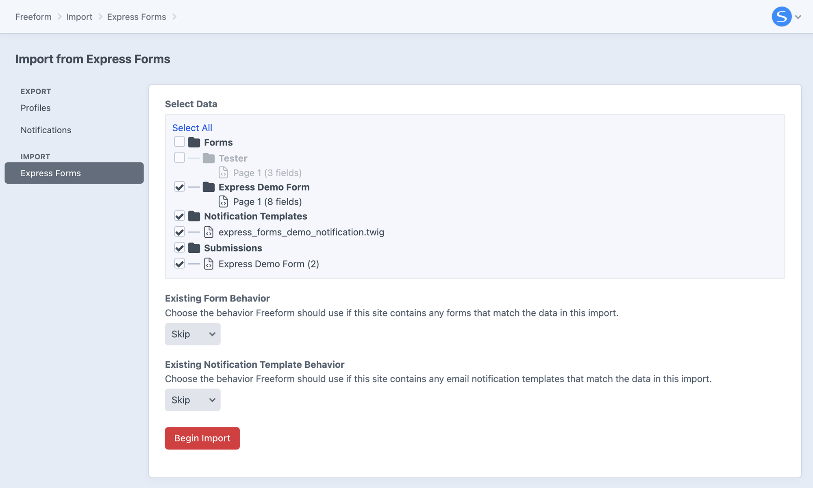

<meta property="og:image" content="https://docs.solspace.com/extras/social/craft/freeform/freeform.png" />

    
    Freeform
    for Craft
    

        

            5.x
            ✓ Latest
            
        

        <ul class="pr-v-list">
            <li><a href="/craft/freeform/v5/">5.x✓ Latest</a></li>
            <li><a href="/craft/freeform/v4/">4.x</a></li>
            <li><a href="/craft/freeform/v3/">3.xRetired</a></li>
            <li><a href="/craft/freeform/v2/">2.xRetired</a></li>
            <li><a href="/craft/freeform/v1/">1.xRetired</a></li>
        </ul>
    

    

        <a href="https://plugins.craftcms.com/freeform" class="button button-blue">Plugin Store</a>
    

<a href="/craft/freeform/v5/setup/">Installing & Updating</a>

# Migration from Express Forms

If you wish to migrate from [Express Forms](https://plugins.craftcms.com/express-forms) to Freeform 5, please follow the special instructions below.

::: warning
Due to the nature of this update we recommend anyone migrating from Express Forms 2.x to do so carefully in a development environment and follow the special instructions below.
:::

[[toc]]

## Key Differences

Compared to Express Forms, Freeform 5 offers significantly more features and options. Here are the key differences between the two:

| <h4 class="no-margin">Topic</h4> | <h4 class="no-margin yellow">Express Forms</h4> | <h4 class="no-margin green">Freeform 5.x</h4> | <h4 class="no-margin red">Required Action</h4> |
| :--- | :--- | :--- | :--- |
| **Plugin Editions**Affects: **All**

 | Express Forms offered the following editions: <ul><li>**Lite**: offers all features except integrations.</li><li>**Pro**: offers all features including integrations.</li></ul> | Freeform offers the following editions:<ul><li>**Express** (Free): very similar offerings as _Lite_, but has a limit of 1 form and up to 20 fields.</li><li>**Lite** ($99): offers the features that are necessary for most sites.</li><li>**Pro** ($149): enables integrations, Stripe payments, additional advanced field types, conditional rules logic, additional export options, mapping submission data to Craft elements and more.</li></ul> | To choose the edition that is right for you, check out the [Compare](../#compare) table for a complete breakdown of features for each edition. Please note that a fresh install of Freeform will likely automatically install the free _Express_ edition. You will need to [switch editions](./installing-updating/#changing-editions) to enable _Lite_ or _Pro_. |
| **Form Builder**Affects: **All**

 | The Express Forms form builder was intentionally simple. It offered just enough controls to build and configure your forms. | Everything is at your fingertips in our elegant and intuitive form builder. The Freeform form builder is an all-in-one interface that lets you take control of almost every aspect of your forms. | Be sure to explore and take advantage of all the new options available in Freeform. Check out the [Form Builder](../forms/builder/) documentation for a tour of the form builder. |
| **Field Types**Affects: **All**

 | Express Forms offers a very basic set of field types. It's up to you if you want to expand on how those fields look and behave in your template. | Freeform offers an extensive set of field types and the ability to configure them more in-depth directly inside the form builder. | Your fields will be migrated to the same or similar field type in Freeform. If you wish to change any of those fields, you can simply change the field type of these directly inside the form builder. Specifically, the **Options** field type will be converted to Freeform's **Checkboxes** field type. If it should be a **Dropdown** or **Radios**, you can change it after the migration. Check out the [Fields](../forms/fields/) documentation for a complete list of all field types. |
| **Formatting Templates**Affects: **All**

 | In Express Forms, each form needs to be coded directly into the template page it is being displayed on. | In Freeform you can use sample formatting templates or create your own. The advantage of these are that they can automatically render forms based on how you have layed out the fields and configured them inside the form builder. This also keeps your template code clean since it allows you to create a template once and reuse it for as many forms as you like. | It's possible to manually _hard code_ your forms the way you have been in Express Forms, but we highly encourage you to check out the formatting template feature. Check out the [Formatting Templates](../templates/formatting/) documentation for more information. |
| **Spam Protection**Affects: **All**

 | Express Forms only offers a honeypot and **reCAPTCHA v2 Checkbox** for spam protection. | Freeform offers a wide variety of spam protection features including **reCAPTCHA**, **hCaptcha**, **Honeypot**, **Javascript Test** and **Blocked Keywords**, most of which can be configured per form as well. There is also a built-in **Spam Folder** that allows you to review and retrieve any submissions that were flagged as spam by Freeform. | All spam protection controls and captchas need to be set up again in Freeform. We encourage you to consider upgrading any spam protection as well, e.g. use _reCAPTCHA v3_ instead of _reCAPTCHA v2 Checkbox_, add blocked keywords, etc. Check out the [Spam Protection](../forms/spam-protection/) documentation for more information. |
| **Integrations**Affects: **Most**

 | Express Forms offered a small set of common integrations. | Freeform offers a wide variety of integrations, and these are handled a bit differently than Express Forms. Because of this, no integrations are migrated, and will need to be recreated. | The migration from Express Forms will **NOT** import any integrations. They will need to be set up again in Freeform. This includes **CRM**, **Email Marketing**, **Captchas**, etc. Check out the [Integrations](../integrations/) documentation for a complete list of all integrations. |
| **Dynamic Recipients**Affects: **Some**

 | To allow users to dynamically choose which admin should receive the email notification, a **Dynamic Recipients** feature was offered at the template level. | Freeform allows users to select which recipient(s) the form submission should be emailed to using any regular option-based field type that is configured as a **User Select** field inside the form builder. This allows for much greater power and flexibility, and allows values to be stored correctly in the database. There is also the ability to create **Conditional Notifications** inside the form builder as well. | The migration from Express Forms will be unable to detect any **Dynamic Recipient** setups due to them being based directly inside the template, so this **will NOT be migrated**. Please take advantage of reconfiguring these in Freeform's **User Select** or **Conditional** notification options in the form builder. Check out the [Email Notifications](../forms/email-notifications/) documentation for more information. |
| **GraphQL**Affects: **Few**

 | No support for GraphQL. | Freeform supports querying form layouts and using mutations to create submissions via **GraphQL**. | Check out the  [Headless](../headless/) documentation for more information. |

## Running the Migration

::: danger
Be sure to back up your site files and database before proceeding.
:::

<label for="step1"><input type="checkbox" class="step-check" id="step1">

### Install Freeform 5

</label>

[Install Freeform 5](installing-updating/) while on Craft 4 if you haven't already done so.

::: tip
If you plan to upgrade from Craft 4 to Craft 5, we strongly recommend running this migration while still on Craft 4, as there is no Craft 5-compatible version of Express Forms. Freeform 5 is compatible with both Craft 4 and Craft 5.
:::

<label for="step2"><input type="checkbox" class="step-check" id="step2">

### Go to the Migration utility

</label>

1. Go to the **Import / Export** section in the Freeform control panel.
2. In the left column, click on **Migrate from Express Forms**. It will appear as long as Express Forms is currently installed.

<label for="step3"><input type="checkbox" class="step-check" id="step3">

### Run the Migration utility

</label>

1. Go to the **Import / Export** section in the Freeform control panel.
2. In the left column, click on **Migrate from Express Forms**. It will appear as long as Express Forms is currently installed.
3. Select which forms, notification templates and submission sets you'd like to import.
4. Choose the behavior the import should observe if it runs into forms and notification templates with the same name in Freeform.
    - There currently is no duplicate submission detection options at this point.

<label for="step4"><input type="checkbox" class="step-check" id="step4">

### Cleanup

</label>

There will almost certainly be some amount of cleanup required for every site.

- Review the [key differences](#key-differences) table above and make any necessary or recommended changes.
- Review and update all Freeform settings, submission data and forms in the form builder.
- Review and update your templates and formatting templates (if you have any custom ones) and ensure that everything works correctly and any necessary updates are made.

Finished!

