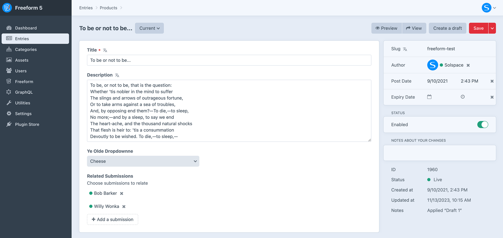

<meta property="og:image" content="https://docs.solspace.com/extras/social/craft/freeform/freeform.png" />

    
    Freeform
    for Craft
    

        

            5.x
            ✓ Latest
            
        

        <ul class="pr-v-list">
            <li><a href="/craft/freeform/v5/">5.x✓ Latest</a></li>
            <li><a href="/craft/freeform/v4/">4.x</a></li>
            <li><a href="/craft/freeform/v3/">3.xRetired</a></li>
            <li><a href="/craft/freeform/v2/">2.xRetired</a></li>
            <li><a href="/craft/freeform/v1/">1.xRetired</a></li>
        </ul>
    

    

        <a href="https://plugins.craftcms.com/freeform" class="button button-blue">Plugin Store</a>
    

<a href="/craft/freeform/v5/submissions/">Submissions</a>

# _Submissions_ Element Field Type 
<Badge type="lite" text="Lite" /><Badge type="pro" text="Pro" />

Freeform includes a *Freeform Submissions* field type (and [Freeform Form](../forms/fieldtype/)), which allows you to assign/relate submissions to other element types such as Craft Entries.

[[toc]]

## Overview

When pairing the Freeform Submissions field type with the [Relations](./relations/) feature, Freeform can do extraordinary things like become a tool that let's your users comment on entries, submit ratings and reviews for Commerce products and more! The [Relations](./relations/) feature essentially allows you to feed another Craft Element ID to the form that is attached to the submission(s), and the Freeform submission then becomes attached to the other element the same way an Asset does, etc.

<video autoplay loop muted>
    <source src="../videos/fieldtype-submissions.mp4" type="video/mp4">
    This browser does not display the video tag.
</video>

### Creating the Field
Creating a Freeform Submissions field is done just like any other field type, here's an overview of the process:

<label for="step1b"><input type="checkbox" class="step-check" id="step1b">

Go to the **Settings** area in Craft control panel. Click on **Fields**.

</label>

Click the **New field** button in the top right corner.

<label for="step2b"><input type="checkbox" class="step-check" id="step2b">

Name the field as you wish. For example: *Related Submissions* with a handle of `relatedSubmissions`.

</label>

<label for="step3b"><input type="checkbox" class="step-check" id="step3b">

For the **Field Type** option, select *Freeform Submissions* from the list.

</label>

**Selection Label** is the text that will appear on the button which opens the Freeform Submissions selection pop-up dialog.

<label for="step4b"><input type="checkbox" class="step-check" id="step4b">

Click the **Save** button in the top right corner to save the new field.

</label>

Finished!

Your Freeform Submissions field is now available to be assigned to other sections.