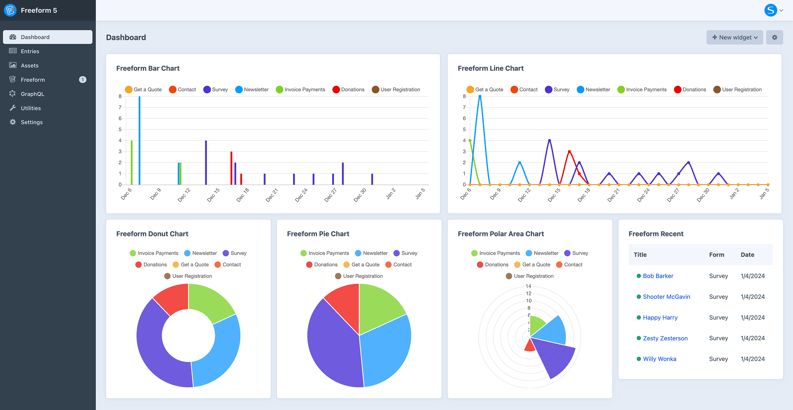
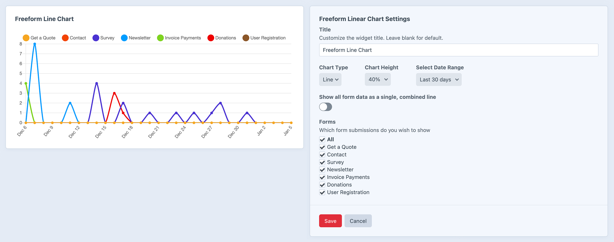
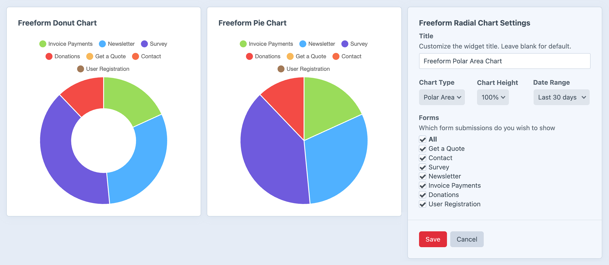
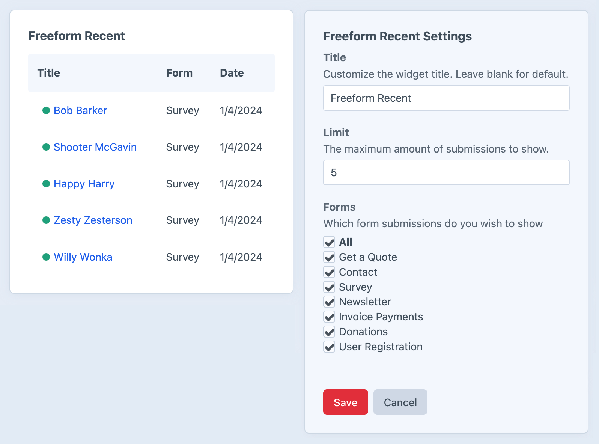
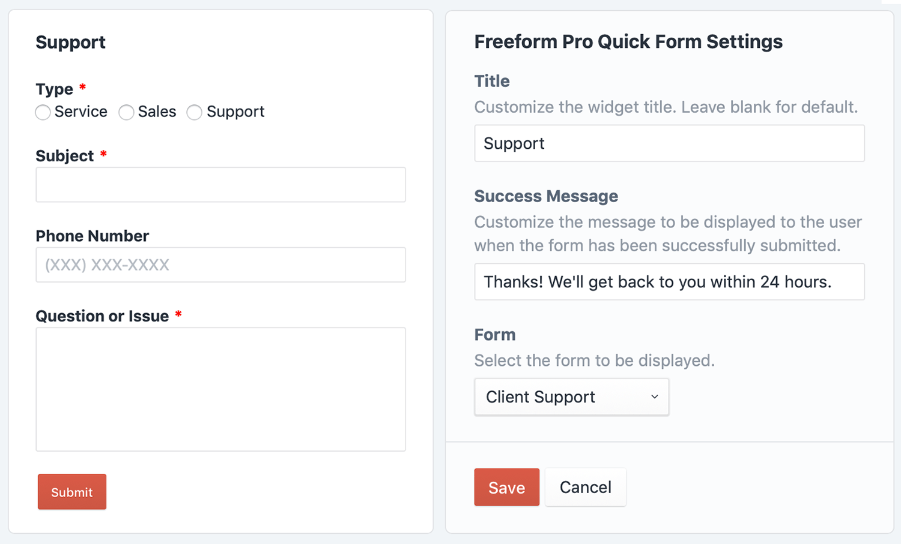

<meta property="og:image" content="https://docs.solspace.com/extras/social/craft/freeform/freeform.png" />

    
    Freeform
    for Craft
    

        

            5.x
            ✓ Latest
            
        

        <ul class="pr-v-list">
            <li><a href="/craft/freeform/v5/">5.x✓ Latest</a></li>
            <li><a href="/craft/freeform/v4/">4.x</a></li>
            <li><a href="/craft/freeform/v3/">3.xRetired</a></li>
            <li><a href="/craft/freeform/v2/">2.xRetired</a></li>
            <li><a href="/craft/freeform/v1/">1.xRetired</a></li>
        </ul>
    

    

        <a href="https://plugins.craftcms.com/freeform" class="button button-blue">Plugin Store</a>
    

<a href="/craft/freeform/v5/submissions/">Submissions</a>

# Dashboard Widgets <Badge type="pro" text="Pro" />

_Freeform Pro_ includes a total of 4 dashboard widgets.

[[toc]]

## Linear Chart widget <Badge type="pro" text="Pro" />
This widget allows you to display a **line** or **bar** chart form your submissions. Chart colors are controlled by the **Form Color** setting inside the form builder for each form (_Settings_ → _General_).

### Configuration

- **Title** - enter a custom widget title, or leave blank to use default.
- **Chart Type** - choose from **Line** or **Bar**.
- **Chart Height** - customize the display height of widget.
- **Date Range**:
    - Last 24 hours
    - Last 7 days
    - Last 30 days
    - Last 60 days
    - Last 90 days
- **Display all Form Data as a Single Combined Line**
    - If enabled, it combines all selected forms into a single value to be displayed as a line/bars.
- **Forms** - choose **All** forms or select which ones you'd like to show submissions from.

## Radial Chart widget <Badge type="pro" text="Pro" />
This widget allows you to display a **pie**, **donut** or **polar area** chart form your submissions. Chart colors are controlled by the **Form Color** setting inside the form builder for each form (_Settings_ → _General_).

### Configuration

- **Title** - enter a custom widget title, or leave blank to use default.
- **Chart Type** - choose from **Pie**, **Donut** or **Polar Area**.
- **Chart Height** - customize the display height of widget.
- **Date Range**:
    - Last 24 hours
    - Last 7 days
    - Last 30 days
    - Last 60 days
    - Last 90 days
- **Forms** - choose **All** forms or select which ones you'd like to show submissions from.

## Recent Submissions widget <Badge type="pro" text="Pro" />
This widget allows you to display a list of the most recent submissions from your form(s).

### Configuration

- **Title** - enter a custom widget title, or leave blank to use default.
- **Limit** - select the maximum number of submissions to be displayed.
- **Forms** - choose **All** forms or select which ones you'd like to show submissions from.

## Quick Form widget <Badge type="pro" text="Pro" />
This widget allows you to display regular Freeform forms inside the Craft Dashboard. The most common use case would be for setting up a support form for your clients to contact you from if they have any questions or issues.

### Configuration

- **Title** - enter a custom widget title, or leave blank to use default.
- **Success Message** - set the message to be displayed to the user when the form has been successfully submitted.
- **Forms** - choose which form to use.

::: warning
This currently will not work with multi-page forms, and some complex forms might have limitations.
:::