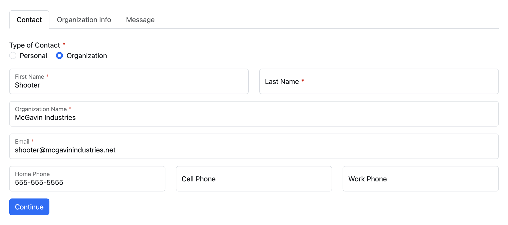

<meta property="og:image" content="https://docs.solspace.com/extras/social/craft/freeform/freeform.png" />

<div id="pr-heading">
    
    <span class="pr-name">Freeform</span>
    <span class="pr-category">for Craft</span>
    <div class="pr-v-wrapper">
        <div class="pr-v">
            <span class="pr-v-v">5.x</span>
            <span class="pr-v-type pr-latest">✓ Latest</span>
            <span class="pr-v-arrow arrow down"></span>
        </div>
        <ul class="pr-v-list">
            <li><a href="/craft/freeform/v5/">5.x<span class="pr-v-type pr-latest">✓ Latest</span></a></li>
            <li><a href="/craft/freeform/v4/">4.x</a></li>
            <li><a href="/craft/freeform/v3/">3.x<span class="pr-v-type pr-retired">Retired</span></a></li>
            <li><a href="/craft/freeform/v2/">2.x<span class="pr-v-type pr-retired">Retired</span></a></li>
            <li><a href="/craft/freeform/v1/">1.x<span class="pr-v-type pr-retired">Retired</span></a></li>
        </ul>
    </div>
    <div class="pr-buy">
        <a href="https://plugins.craftcms.com/freeform" class="button button-blue"><span class="external-url">Plugin Store</span></a>
    </div>
</div>

<span class="page-section"><a href="/craft/freeform/v5/templates/formatting/">Formatting Templates</a></span>

# Bootstrap 5 with Floating Labels <Badge type="feature" text="Improved in 5.0+" />

This example makes use of Bootstrap's [Floating Labels](https://getbootstrap.com/docs/5.3/forms/floating-labels/) feature. The following example assumes you're including necessary [Bootstrap 5](https://getbootstrap.com) JS and CSS. You can place the additional CSS and JS inside the formatting template or add to your site's CSS / JS files.


[[toc]]


## Preview



::: video 78LAmvZ0yoA/?start=224
Video: Preview of Formatting Template Examples
:::


## Templates

<div class="code-tabs">

<div class="code-tab-directory">/bootstrap-5-floating-labels/</div>

<input type="radio" name="code-tabs" tabindex="1" id="code-tab-1" checked="checked">
<label for="code-tab-1" class="code-tab-twig">index.twig</label>
<div class="code-tab-panel" tabindex="1">

``` twig
{# Pull in CSS and field rendering #}
<style>

</style>


{# Render the opening form tag #}
{{ form.renderTag({
    attributes: {
        row: { class: "row" },
        success: { class: "alert alert-success" },
        errors: { class: "alert alert-danger" },
        novalidate: true,
    },
    buttons: {
        attributes: {
            submit: { class: "btn btn-primary" },
            back: { class: "btn btn-secondary" },
            save: { class: "btn btn-primary" },
        },
    },
    fields: {
        "@global": {
            attributes: {
                container: { class: "mb-3 col-12" },
                input: {
                    class: "form-control"
                },
                label: { class: "mb-1" },
                instructions: { class: "form-text text-muted mt-1" },
                error: { class: "list-unstyled m-0 fst-italic text-danger" },
            },
        },
        ":required": {
            attributes: {
                label: { "+class": "required" },
            },
        },
        ":errors": {
            attributes: {
                input: { "+class": "is-invalid" },
            },
        },
        "@text, @textarea, @email, @website, @confirm, @regex, @phone, @datetime, @dropdown, @multiple-select, @number, @password, @file-dnd, @signature": {
            attributes: {
                container: { "+class": "form-floating" },
            },
        },
        "@group": {
            attributes: {
            label: { "+class": "group-label" },
            },
        },
        "@checkbox" : {
            attributes: {
                input: { "=class": "form-check-input checkbox" },
                label: { "+class": "form-check-label" },
            },
        },
        "@dropdown" : {
            attributes: {
                input: { "+class": "form-select" },
            },
        },
        "@file" : {
            attributes: {
             input: { "+class": "form-control-file" },
            },
        },
        "@signature": {
            attributes: {
                input: {
                    "-class": "form-control",
                    "+class": "btn btn-light"
                },
            },
        },
        "@stripe": {
            attributes: {
                input: {
                    "-class": "form-control",
                },
            },
        },
    },
}) }}

{# Pull in JS overrides #}
<script>

</script>

{# Success and error message handling for non-AJAX forms #}

    
        <div{{ form.attributes.success|raw }}>
            <p>{{ form.settings.successMessage | t('freeform') }}</p>
        </div>
    
    
        <div{{ form.attributes.errors|raw }}>
            <p>{{ form.settings.errorMessage | t('freeform') }}</p>

            
                <ul class="mb-0">
                    
                        <li>{{ error }}</li>
                    
                </ul>
            
        </div>
    


{# Render page tabs if multi-page #}

    <ul class="nav nav-tabs mb-4">
        
            <li class="nav-item">
                <span class="nav-link{{ form.currentPage.index == page.index ? ' fw-bold active' : ' disabled' }}">
                    {{ page.label }}
                </span>
            </li>
        
    </ul>


{# Display form field rows and columns #}
{{ rowMacro.render(form.rows, form) }}

{# Render the closing form tag #}
{{ form.renderClosingTag }}
```

</div>
<input type="radio" tabindex="1" name="code-tabs" id="code-tab-2">
<label for="code-tab-2" class="code-tab-twig">_row.twig</label>
<div class="code-tab-panel" tabindex="1">

``` twig

    
    
        {{- fieldTemplatePath ~ "floating.twig" -}}
    
        {{- fieldTemplatePath ~ type ~ ".twig" -}}
    



    

    

        

        <div{{ form.attributes.row|raw }}>
            

                

                

            
        </div>

    


```

</div>
<input type="radio" tabindex="1" name="code-tabs" id="code-tab-3">
<label for="code-tab-3" class="code-tab-css">_main.css</label>
<div class="code-tab-panel" tabindex="1">

``` css
button[type=submit].freeform-processing {
    display: inline-flex;
    flex-wrap: nowrap;
    align-items: center;
}
button[type=submit].freeform-processing:before {
    content: "";
    display: block;
    flex: 1 0 11px;
    width: 11px;
    height: 11px;
    margin-right: 10px;
    border-style: solid;
    border-width: 2px;
    border-color: transparent transparent #fff #fff;
    border-radius: 50%;
    animation: freeform-processing .5s linear infinite;
}
@keyframes freeform-processing {
    0% {
        transform: rotate(0);
    }
    100% {
        transform: rotate(1turn);
    }
}
label.required:after {
    content: "*";
    color: #d00;
    margin-left: 3px;
}
.alert p:last-of-type {
    margin-bottom: 0;
}
.mt-n1 {
    margin-top: -0.5rem !important;
}

/* FLOATING LABELS SPECIFIC STYLES */
.form-floating > label {
    left: 12px;
}
```

</div>
<input type="radio" tabindex="1" name="code-tabs" id="code-tab-4">
<label for="code-tab-4" class="code-tab-js">_main.js</label>
<div class="code-tab-panel" tabindex="1">

``` js
var form = document.querySelector('[data-id="{{ form.anchor }}"]');
if (form) {
    // Styling for AJAX responses
    form.addEventListener("freeform-ready", function (event) {
        var freeform = event.freeform;

        freeform.setOption("errorClassBanner", ["alert", "alert-danger"]);
        freeform.setOption("errorClassList", ["list-unstyled", "m-0", "fst-italic", "text-danger"]);
        freeform.setOption("errorClassField", ["is-invalid"]);
        freeform.setOption("successClassBanner", ["alert", "alert-success"]);
    })
    // Styling for Stripe Payments field
    form.addEventListener("freeform-stripe-appearance", function (event) {
        event.elementOptions.appearance = Object.assign(
            event.elementOptions.appearance,
            {
                variables: {
                    colorPrimary: "#0d6efd",
                    fontFamily: "-apple-system,BlinkMacSystemFont,\"Segoe UI\",Roboto,\"Helvetica Neue\",Arial,sans-serif,\"Apple Color Emoji\",\"Segoe UI Emoji\",\"Segoe UI Symbol\",\"Noto Color Emoji\"",
                    fontSizeBase: "1rem",
                    spacingUnit: "0.2em",
                    tabSpacing: "10px",
                    gridColumnSpacing: "20px",
                    gridRowSpacing: "20px",
                    colorText: "#212529",
                    colorBackground: "#ffffff",
                    colorDanger: "#dc3545",
                    borderRadius: "0.375rem",
                },
                rules: {
                    '.Tab, .Input': {
                        border: '1px solid #dee2e6',
                        boxShadow: 'none',
                    },
                    '.Tab:focus, .Input:focus': {
                        border: '1px solid #0b5ed7',
                        boxShadow: 'none',
                        outline: '0',
                        transition: 'border-color .15s ease-in-out',
                    },
                    '.Label': {
                        fontSize: '1rem',
                        fontWeight: '400',
                    },
                },
            }
        );
    });
}
```

</div>
<a class="code-tab-directory-link" href="#bootstrap-5-floating-labels-fields">fields/</a>
</div>

<div class="code-tabs" id="bootstrap-5-floating-labels-fields">

<div class="code-tab-directory">/bootstrap-5-floating-labels/fields/</div>

<input type="radio" name="code-tabs-b" tabindex="1" id="code-tab-1b" checked="checked">
<label for="code-tab-1b" class="code-tab-twig">_default.twig</label>
<div class="code-tab-panel" tabindex="1">

``` twig
{{ field.render }}
```

</div>
<input type="radio" tabindex="1" name="code-tabs-b" id="code-tab-2b">
<label for="code-tab-2b" class="code-tab-twig">checkbox.twig</label>
<div class="code-tab-panel" tabindex="1">

``` twig
<div{{ field.attributes.container }}>
    <div class="form-check">
        {{ field.renderInput }}
        {{ field.renderLabel }}
        {{ field.renderInstructions }}
        {{ field.renderErrors }}
    </div>
</div>
```

</div>
<input type="radio" tabindex="1" name="code-tabs-b" id="code-tab-3b">
<label for="code-tab-3b" class="code-tab-twig">checkboxes.twig</label>
<div class="code-tab-panel" tabindex="1">

``` twig
<div{{ field.attributes.container }}>

    {{ field.renderLabel }}

    <div>

    
        <div class="form-check{{ field.oneLine ? " form-check-inline" }}">
            <input type="checkbox"
                   name="{{ field.handle }}[]"
                   value="{{ option.value }}"
                   id="{{ field.idAttribute }}-{{ index }}"
                   class="form-check-input{{ field.hasErrors ? " is-invalid" }}"
                    {{ option.value in field.value ? "checked" }}
            />
            <label class="form-check-label" for="{{ field.idAttribute }}-{{ index }}">
                {{ option.label|t('freeform')|raw }}
            </label>
        </div>
    

    </div>

    {{ field.renderInstructions }}
    {{ field.renderErrors }}

</div>
```

</div>
<input type="radio" tabindex="1" name="code-tabs-b" id="code-tab-4b">
<label for="code-tab-4b" class="code-tab-twig">radios.twig</label>
<div class="code-tab-panel" tabindex="1">

``` twig
<div{{ field.attributes.container }}>

    {{ field.renderLabel }}

    <div>

    
        <div class="form-check{{ field.oneLine ? " form-check-inline" }}">
            <input type="radio"
                   name="{{ field.handle }}"
                   value="{{ option.value }}"
                   id="{{ field.idAttribute }}-{{ index }}"
                   class="form-check-input{{ field.hasErrors ? " is-invalid" }}"
                    {{ option.value == field.value ? "checked" }}
            />
            <label class="form-check-label" for="{{ field.idAttribute }}-{{ index }}">
                {{ option.label|t('freeform')|raw }}
            </label>
        </div>
    

    </div>

    {{ field.renderInstructions }}
    {{ field.renderErrors }}

</div>
```

</div>
<input type="radio" tabindex="1" name="code-tabs-b" id="code-tab-5b">
<label for="code-tab-5b" class="code-tab-twig">group.twig</label>
<div class="code-tab-panel" tabindex="1">

``` twig


<div{{ field.attributes.container }}>
    <div class="card">
        <div class="card-header">
            {{ field.renderLabel }}
            {{ field.renderInstructions }}
        </div>
        <div class="card-body pb-0">
            {{ rowMacro.render(field.layout, form) }}
        </div>
    </div>
</div>
```

</div>
<input type="radio" tabindex="1" name="code-tabs-b" id="code-tab-6b">
<label for="code-tab-6b" class="code-tab-twig">table.twig</label>
<div class="code-tab-panel" tabindex="1">

``` twig
{{ field.render({
    addButtonLabel: "Add +",
    removeButtonLabel: "x",
    tableAttributes: {
        table: { class: "table table-sm table-borderless" },
        input: { class: "form-control" },
        dropdown: { class: "form-control form-select" },
        checkbox: { class: "form-check-input" },
        removeButton: { class: "btn btn-sm btn-danger" },
        addButton: { class: "btn btn-sm btn-success" },
    },
}) }}
```

</div>

<input type="radio" tabindex="1" name="code-tabs-b" id="code-tab-7b">
<label for="code-tab-7b" class="code-tab-twig">textarea.twig</label>
<div class="code-tab-panel" tabindex="1">

``` twig
<div{{ field.attributes.container }}>





{{ field.renderInput -}}
{{- field.renderLabel }}
{{ field.renderInstructions }}
{{ field.renderErrors }}

</div>
```

</div>

<input type="radio" tabindex="1" name="code-tabs-b" id="code-tab-8b">
<label for="code-tab-8b" class="code-tab-twig">dropdown.twig</label>
<div class="code-tab-panel" tabindex="1">

``` twig
<div{{ field.attributes.container }}>

{{ field.renderInput -}}
{{- field.renderLabel }}
{{ field.renderInstructions }}
{{ field.renderErrors }}

</div>
```

</div>

<input type="radio" tabindex="1" name="code-tabs-b" id="code-tab-9b">
<label for="code-tab-9b" class="code-tab-twig">multiple-select.twig</label>
<div class="code-tab-panel" tabindex="1">

``` twig
<div{{ field.attributes.container }}>





{{ field.renderInput -}}
{{- field.renderLabel }}
{{ field.renderInstructions }}
{{ field.renderErrors }}

</div>
```

</div>

<input type="radio" tabindex="1" name="code-tabs-b" id="code-tab-10b">
<label for="code-tab-10b" class="code-tab-twig">floating.twig</label>
<div class="code-tab-panel" tabindex="1">

``` twig
<div{{ field.attributes.container }}>



{{ field.renderInput -}}
{{- field.renderLabel }}
{{ field.renderInstructions }}
{{ field.renderErrors }}

</div>
```

</div>

</div>


## CDN Links
The following CDN links for Bootstrap 5 are for v5.3.1, which may no longer be the latest version. Please see official [Bootstrap 5 documentation](https://getbootstrap.com/docs/5.3/getting-started/download/) for latest versions and CDN links.

``` html
<!-- Latest compiled and minified CSS -->
<link href="https://cdn.jsdelivr.net/npm/bootstrap@5.3.1/dist/css/bootstrap.min.css" rel="stylesheet" integrity="sha384-4bw+/aepP/YC94hEpVNVgiZdgIC5+VKNBQNGCHeKRQN+PtmoHDEXuppvnDJzQIu9" crossorigin="anonymous">

<!-- Latest compiled and minified JavaScript -->
<script src="https://cdn.jsdelivr.net/npm/bootstrap@5.3.1/dist/js/bootstrap.bundle.min.js" integrity="sha384-HwwvtgBNo3bZJJLYd8oVXjrBZt8cqVSpeBNS5n7C8IVInixGAoxmnlMuBnhbgrkm" crossorigin="anonymous"></script>
```


## Live Demo

The demo below is a live [demo site](https://demo.solspace.net/craft/freeform-demo/) that shows most of what the Demo Templates include (some sections and data has been limited).

<div class="demo-buttons">
    <a href="https://demo.solspace.net/craft/freeform-demo/templates/bootstrap-5-floating-labels/contact" target="_blank">Open in New Window</a>
</div>
<iframe title="App Demo" id="app-demo" src="https://demo.solspace.net/craft/freeform-demo/templates/bootstrap-5-floating-labels/contact" scrolling="yes" height="1600px" width="100%" class="app-demo" frameborder="0"></iframe>
