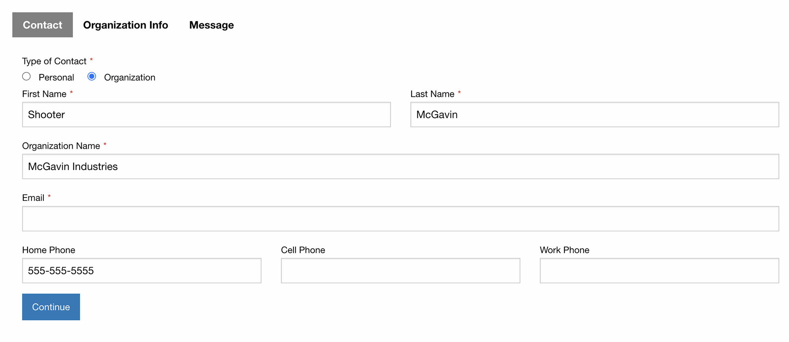

<meta property="og:image" content="https://docs.solspace.com/extras/social/craft/freeform/freeform.png" />

<div id="pr-heading">
    
    <span class="pr-name">Freeform</span>
    <span class="pr-category">for Craft</span>
    <div class="pr-v-wrapper">
        <div class="pr-v">
            <span class="pr-v-v">5.x</span>
            <span class="pr-v-type pr-latest">✓ Latest</span>
            <span class="pr-v-arrow arrow down"></span>
        </div>
        <ul class="pr-v-list">
            <li><a href="/craft/freeform/v5/">5.x<span class="pr-v-type pr-latest">✓ Latest</span></a></li>
            <li><a href="/craft/freeform/v4/">4.x</a></li>
            <li><a href="/craft/freeform/v3/">3.x<span class="pr-v-type pr-retired">Retired</span></a></li>
            <li><a href="/craft/freeform/v2/">2.x<span class="pr-v-type pr-retired">Retired</span></a></li>
            <li><a href="/craft/freeform/v1/">1.x<span class="pr-v-type pr-retired">Retired</span></a></li>
        </ul>
    </div>
    <div class="pr-buy">
        <a href="https://plugins.craftcms.com/freeform" class="button button-blue"><span class="external-url">Plugin Store</span></a>
    </div>
</div>

<span class="page-section"><a href="/craft/freeform/v5/templates/formatting/">Formatting Templates</a></span>

# Foundation 6 <Badge type="feature" text="Improved in 5.0+" />

The following example assumes you're including necessary [Foundation 6](https://get.foundation/) JS and CSS. You can place the additional CSS and JS inside the formatting template or add to your site's CSS / JS files.


[[toc]]


## Preview



::: video 78LAmvZ0yoA/?start=338
Video: Preview of Formatting Template Examples
:::


## Templates

<div class="code-tabs">

<div class="code-tab-directory">/foundation-6/</div>

<input type="radio" name="code-tabs" tabindex="1" id="code-tab-1" checked="checked">
<label for="code-tab-1" class="code-tab-twig">index.twig</label>
<div class="code-tab-panel" tabindex="1">

``` twig
{# Pull in CSS and field rendering #}
<style>

</style>


{# Render the opening form tag #}
{{ form.renderTag({
    attributes: {
        row: { class: "grid-x grid-margin-x" },
        success: { class: "callout success" },
        errors: { class: "callout alert" },
        novalidate: true,
    },
    buttons: {
        attributes: {
            container: { class: "cell submit-buttons" },
            submit: { class: "button primary" },
            back: { class: "button secondary" },
            save: { class: "button primary" },
        },
    },
    fields: {
        "@global": {
            attributes: {
                container: { class: "cell" },
                label: { class: "freeform-label" },
                input: {
                    class: "freeform-field",
                },
                instructions: { class: "help-text" },
                error: { class: "no-bullet freeform-errors" },
            },
        },
        ":required": {
            attributes: {
                label: { "+class": "required" },
            },
        },
        ":errors": {
            attributes: {
                input: { "+class": "has-errors" },
            },
        },
        "@group": {
            attributes: {
                label: { "+class": "h6" },
            },
        },
        "@signature": {
            attributes: {
                input: { "+class": "button small secondary" },
            },
        },
    },
}) }}

{# Pull in JS overrides #}
<script>

</script>

{# Success and error message handling for non-AJAX forms #}

    
        <div{{ form.attributes.success|raw }}>
            <p>{{ form.settings.successMessage | t('freeform') }}</p>
        </div>
    
    
        <div{{ form.attributes.errors|raw }}>
            <p>{{ form.settings.errorMessage | t('freeform') }}</p>

            
                <ul class="mb-0">
                    
                        <li>{{ error }}</li>
                    
                </ul>
            
        </div>
    


{# Render page tabs if multi-page #}

    <ul class="menu freeform-page-tabs">
        
            <li class="menu-text{{ form.currentPage.index == page.index ? ' is-active' : '' }}">
                {{ page.label }}
            </li>
        
    </ul>


{# Display form field rows and columns #}
{{ rowMacro.render(form.rows, form) }}

{# Render the closing form tag #}
{{ form.renderClosingTag }}
```

</div>
<input type="radio" tabindex="1" name="code-tabs" id="code-tab-2">
<label for="code-tab-2" class="code-tab-twig">_row.twig</label>
<div class="code-tab-panel" tabindex="1">

``` twig

    
    {{- fieldTemplatePath ~ type ~ ".twig" -}}



    

    <div class="grid-container">

    

        

        <div{{ form.attributes.row|raw }}>
            

                

                

            
        </div>

    

    </div>


```

</div>
<input type="radio" tabindex="1" name="code-tabs" id="code-tab-3">
<label for="code-tab-3" class="code-tab-css">_main.css</label>
<div class="code-tab-panel" tabindex="1">

``` css
button[type=submit].freeform-processing {
    display: inline-flex;
    flex-wrap: nowrap;
    align-items: center;
}
button[type=submit].freeform-processing:before {
    content: "";
    display: block;
    flex: 1 0 11px;
    width: 11px;
    height: 11px;
    margin-right: 10px;
    border-style: solid;
    border-width: 2px;
    border-color: transparent transparent #fff #fff;
    border-radius: 50%;
    animation: freeform-processing .5s linear infinite;
}
@keyframes freeform-processing {
    0% {
        transform: rotate(0);
    }
    100% {
        transform: rotate(1turn);
    }
}

.cell > label:first-child,
.freeform-fieldtype-checkbox > label {
    font-weight: 600;
    margin-bottom: 2px;
}
input,
textarea,
select {
    margin-bottom: 0 !important;
}
.input-group-one-line label {
    display: inline-block;
    margin: 0 15px 0 0;
}
input[type="radio"],
input[type="checkbox"] {
    margin: 0 7px 0 0;
    padding: 0;
}
input[type="radio"] + label,
input[type="checkbox"] + label {
    margin: 0;
    padding: 0;
}
label.required:after {
    content: "*";
    margin-left: 3px;
    color: red;
}
.freeform-fieldtype-group > .grid-container {
    margin: -7px -15px -2px;
}
.freeform-table-button-green {
    background: green;
}
.freeform-table-button-red {
    background: red;
}

.freeform-page-tabs {
    border-bottom: 1px solid gray;
    margin-bottom: 15px;
}
.freeform-page-tabs li {
    font-weight: normal !important;
    color: gray !important;
}
.freeform-page-tabs li.is-active {
    font-weight: bold !important;
    color: black !important;
    border: 1px solid gray;
    border-bottom: none;
    background: lightgray;
}
.grid-margin-x {
    padding: 7px 0;
}
.errors {
    color: red;
    margin-bottom: 0 !important;
}
.help-text {
    color: gray;
    line-height: 1.8;
    margin-top: -8px;
    margin-bottom: 2px;
}
.has-error {
    border: 1px solid red;
}
.submit-buttons {
    margin-top: 20px !important;
}
```

</div>
<input type="radio" tabindex="1" name="code-tabs" id="code-tab-4">
<label for="code-tab-4" class="code-tab-js">_main.js</label>
<div class="code-tab-panel" tabindex="1">

``` js
var form = document.querySelector('[data-id="{{ form.anchor }}"]');
if (form) {
    // Styling for AJAX responses
    form.addEventListener("freeform-ready", function (event) {
        var freeform = event.freeform;
        freeform.setOption("errorClassBanner", ["callout", "alert"]);
        freeform.setOption("errorClassList", ["errors"]);
        freeform.setOption("errorClassField", "has-error");
        freeform.setOption("successClassBanner", ["callout", "success"]);
    });
    // Styling for Stripe Payments field
    form.addEventListener("freeform-stripe-appearance", function (event) {
        event.elementOptions.appearance = Object.assign(
            event.elementOptions.appearance,
            {
                variables: {
                    colorPrimary: "#0d6efd",
                },
            }
        );
    });
}
```

</div>
<a class="code-tab-directory-link" href="#foundation-6-fields">fields/</a>
</div>

<div class="code-tabs" id="foundation-6-fields">

<div class="code-tab-directory">/foundation-6/fields/</div>

<input type="radio" name="code-tabs-b" tabindex="1" id="code-tab-1b" checked="checked">
<label for="code-tab-1b" class="code-tab-twig">_default.twig</label>
<div class="code-tab-panel" tabindex="1">

``` twig
{{ field.render }}
```

</div>
<input type="radio" tabindex="1" name="code-tabs-b" id="code-tab-2b">
<label for="code-tab-2b" class="code-tab-twig">checkbox.twig</label>
<div class="code-tab-panel" tabindex="1">

``` twig
<div{{ field.attributes.container }}>

{{ field.renderInput -}}
{{- field.renderLabel }}
{{ field.renderInstructions }}
{{ field.renderErrors }}

</div>
```

</div>
<input type="radio" tabindex="1" name="code-tabs-b" id="code-tab-3b">
<label for="code-tab-3b" class="code-tab-twig">group.twig</label>
<div class="code-tab-panel" tabindex="1">

``` twig


<div{{ field.attributes.container }}>
    {{ field.renderLabel }}
    {{ field.renderInstructions }}

    {{ rowMacro.render(field.layout, form) }}
</div>
```

</div>
<input type="radio" tabindex="1" name="code-tabs-b" id="code-tab-4b">
<label for="code-tab-4b" class="code-tab-twig">table.twig</label>
<div class="code-tab-panel" tabindex="1">

``` twig


{{ field.render({
    addButtonLabel: "Add +",
    removeButtonLabel: "x",
    tableAttributes: {
        table: { class: "table-field" },
        row: { class: "table-row" },
        column: { class: "table-column" },
        label: { class: "table-heading-label" },
        input: { class: "table-input" },
        dropdown: { class: "table-select" },
        checkbox: { class: "table-checkbox" },
        removeButton: { class: "button small alert" },
        addButton: { class: "button small success" },
    },
}) }}
```

</div>

</div>


## CDN Links
The following CDN links for Foundation are for v6.8.1, which may no longer be the latest version. Please see official [Foundation documentation](https://get.foundation/sites/docs/installation.html#cdn-links) for latest versions and CDN links.

``` html
<!-- Compressed CSS -->
<link rel="stylesheet" href="https://cdn.jsdelivr.net/npm/foundation-sites@6.8.1/dist/css/foundation.min.css" crossorigin="anonymous">

<!-- Compressed JavaScript -->
<script src="https://cdn.jsdelivr.net/npm/foundation-sites@6.8.1/dist/js/foundation.min.js" crossorigin="anonymous"></script>
```
